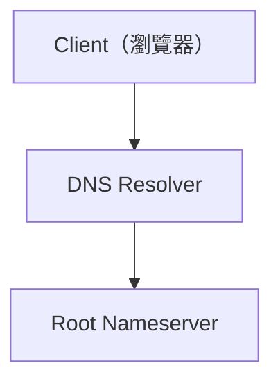
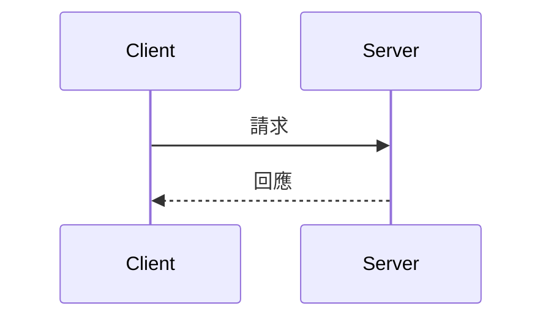

# AGENT.md — System-design 筆記整理指引

本文件規範本倉庫的筆記整理工作流程。每個主題以一個資料夾存放，內含原始 Excalidraw 圖檔與整理後的 Markdown 文件。

## 一、專案結構

```
System-design/
├── Communication Patterns/
│   ├── Communication Patterns.excalidraw   # 原始圖檔（VS Code Excalidraw 外掛編輯）
│   └── Communication Patterns.md           # 整理後的 Markdown 文件
├── Data Structure/
│   └── DesignData Structure.excalidraw     # 尚未整理
├── DNS/
│   ├── DNS.excalidraw
│   └── DNS.md
└── README.md
```

## 二、核心任務

將 Excalidraw 筆記轉換為**詳細的 Markdown 文件**，並把 Excalidraw 的圖轉成 **Mermaid** 放入 Markdown。

### 轉換鐵則

1. **Excalidraw 內容不可減少**：所有文字、方塊、箭頭關係、註解都要完整收錄，不得刪減。
2. **圖轉 Mermaid**：Excalidraw 中的方塊/箭頭/流程/時序，一律用 Mermaid 重新描述，放在對應章節，不得只寫成文字或省略。
3. **以資深 .NET 開發者為目標讀者**：作者具 **7 年 .NET / ASP.NET Core 開發經驗**。內容必須包含**實作細節、C# 程式碼範例、架構考量、最佳實踐與陷阱**，不可停留在概念層面。
4. **內容愈詳細愈好**：寧可多寫，不可少寫；每個技術點都要展開說明，必要時附程式碼、流程圖、比較表。

## 三、標題層級規範

標題層級嚴格統一，不得跳級或混用：

| 層級 | 格式 | 範例 |
|------|------|------|
| 文件標題 | `#`（無序號） | `# DNS 負載平衡與解析流程` |
| 主章節 | `# 一、`（中文序數） | `# 一、內容總覽` |
| 小節 | `## 1.`（阿拉伯數字） | `## 1. 先認識登場角色` |
| 子項 | `### I.`（羅馬數字大寫） | `### I. Round Robin DNS` |
| 再下一層 | `#### i.`（羅馬數字小寫） | `#### i. 進階實作重點` |

## 四、文件結構

每份 MD 建議遵循以下結構：

1. **文件標題**（`#`）：直接以主題命名，**不得**在 blockquote 寫「對應圖檔：XX.excalidraw」——原始圖檔與 MD 同在一個資料夾，讀者無需此資訊。
2. **內容總覽**（`# 一、`）：以主題導覽或全覽圖呈現各章節，**不得**列出「MD 章節 ↔ 圖檔位置」對應表
3. **主體章節**：依主題拆解（`# 二、` 起），完整展開
4. **總結**：收斂重點

## 五、語言與寫作風格

- 以**繁體中文**撰寫。
- 技術名詞保留英文原文，必要時附中文翻譯，例如 `DNS Resolver（遞迴解析器）`、`PTR（Pointer Record，指標記錄）`。
- 善用表格、列表、blockquote 補充說明，讓新手與資深開發者都能讀懂。
- 撰寫時以「**讀者要拿去實作**」為目標：給結論、給理由、給程式碼、給陷阱。

## 六、Mermaid 使用重點

- **流程 / 架構圖**：用 `flowchart TD` 或 `flowchart LR`。
- **時序 / 互動**：用 `sequenceDiagram`。
- 節點文字較長時用引號包裹，需要換行用 `<br/>`。
- 每個 Mermaid 區塊都必須是完整可渲染的語法（可在 renderer 驗證）。

### 範例





## 七、常用圖表對照

| 圖形元素 | Mermaid 對應 |
|----------------|--------------|
| 方塊（rectangle）+ 文字 | 節點 `A["文字"]` |
| 箭頭（arrow） | 邊 `A --> B` |
| 文字標籤（獨立 text） | 節點或邊標籤 `-->|"標籤"|` |
| 流程分支（菱形判定） | `flowchart` + 邊標籤 |
| 逐步流程（時序） | `sequenceDiagram` |

## 八、資料夾命名約定

- 資料夾名稱＝主題名稱（例如 `DNS`、`Communication Patterns`）。
- Markdown 檔名＝資料夾名稱（例如 `DNS/DNS.md`）。
- 原始圖檔保留為 `*.excalidraw`，與 MD 放在同一資料夾。
