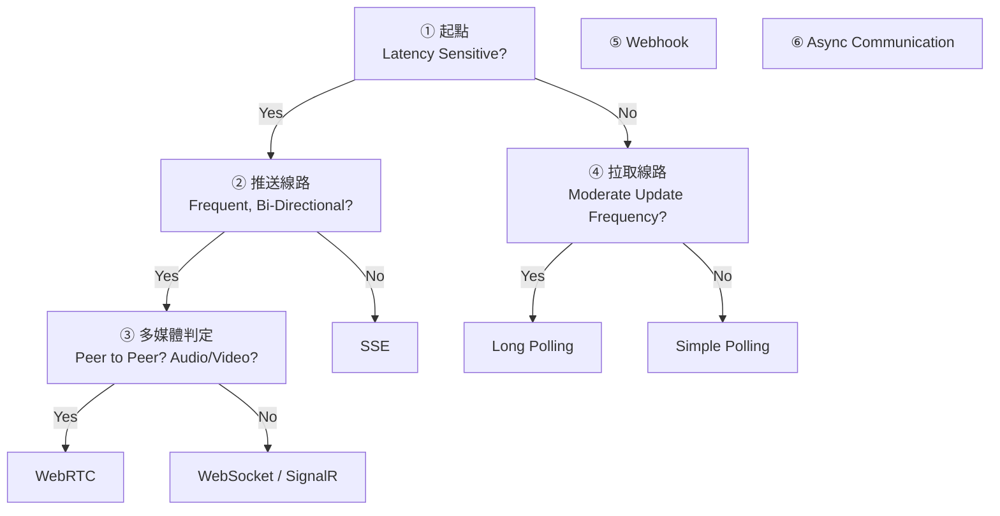
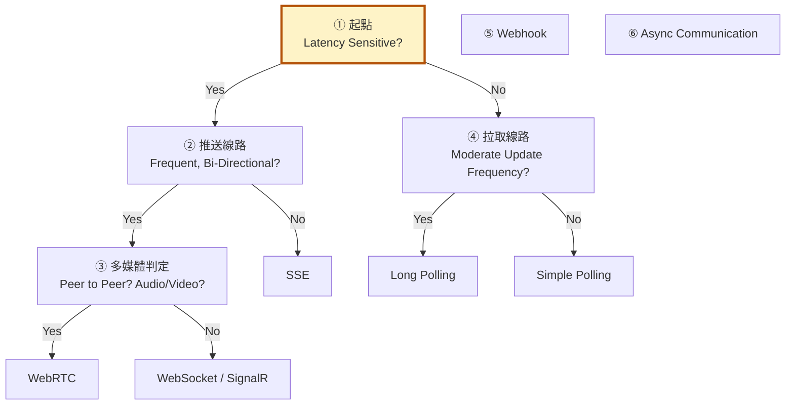
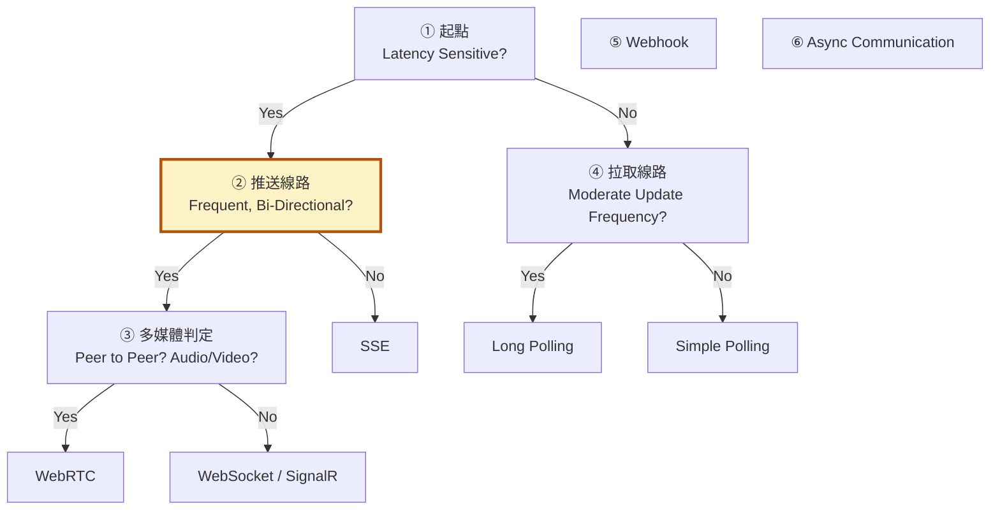
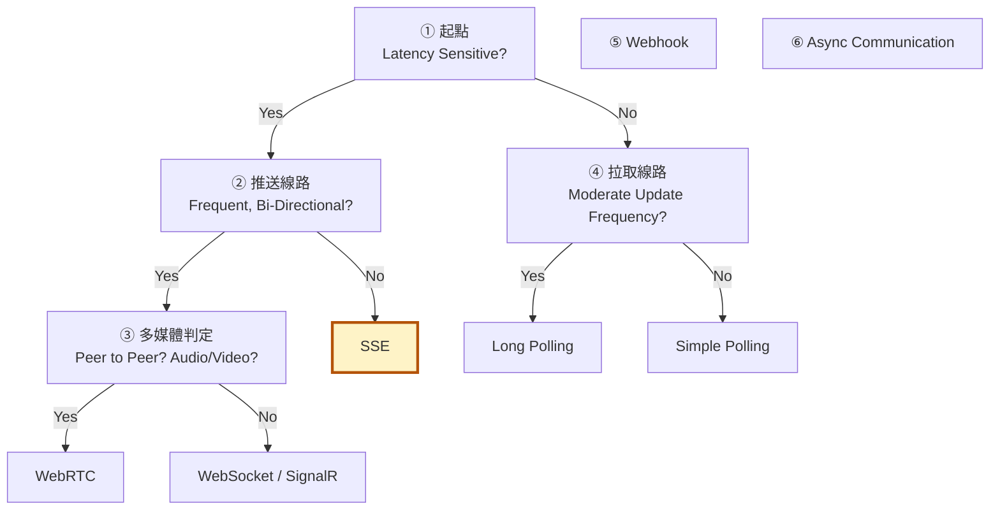
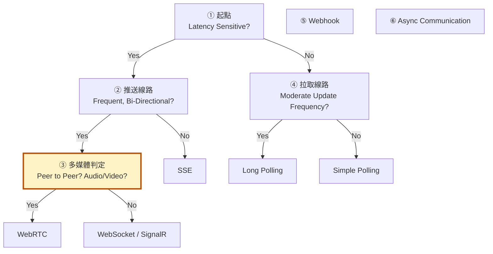
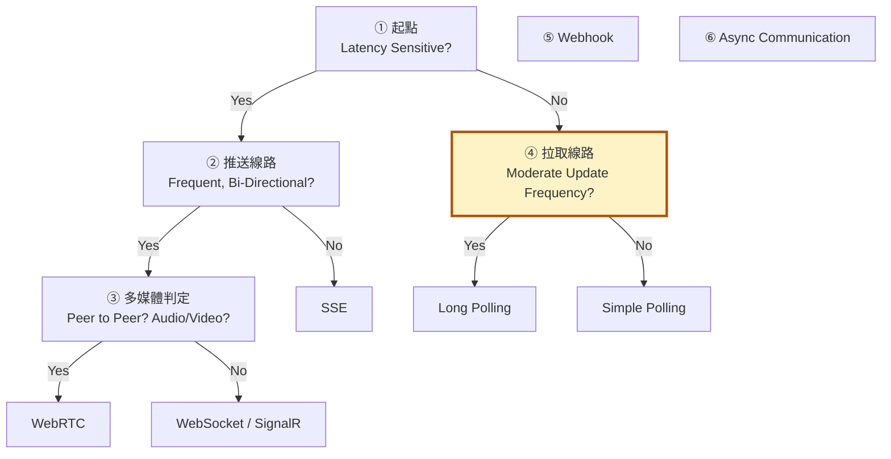
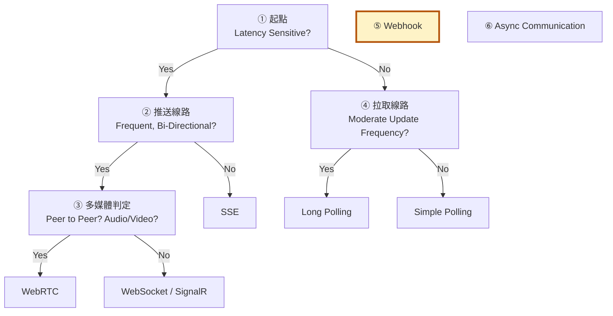
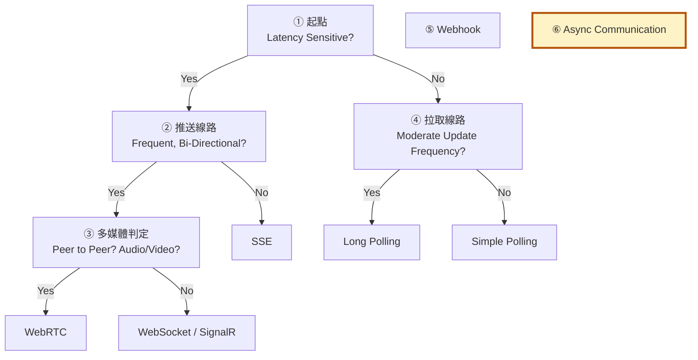
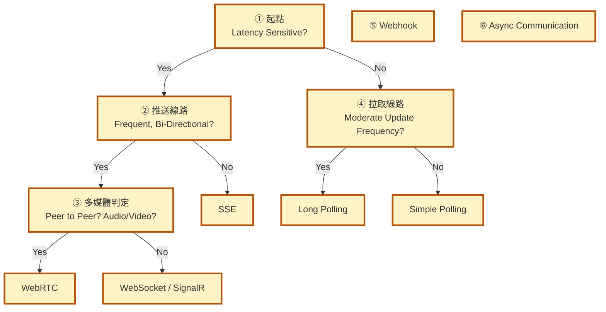
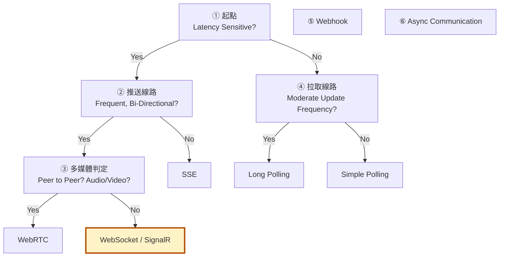

# 即時通訊選型決策流程

> 對應圖檔：`Communication Patterns.excalidraw`
> 走法由**左上**開始，依 Yes/No 一路走到最終方案。
> 本篇以 **.NET / ASP.NET Core** 開發者的角度撰寫，含實作細節與架構考量。

---

# 一、選型總覽
## 1. 對應表（MD ↔ Excalidraw）

| MD 章節 | Excalidraw 位置 | 內容 |
|---------|----------------|------|
| ① 起點 | 圖左上第一個菱形 | Latency Sensitive? |
| ② 推送線路 | 圖右側中間菱形 | Frequent, Bi-Directional? |
| ③ 多媒體判定 | 圖右側上方菱形 | Peer to Peer? Audio/Video? |
| ④ 拉取線路 | 圖左側下方菱形 | Moderate Update Frequency? |
| ⑤ Webhook | 圖右上角方塊 | 伺服器對伺服器非同步推送 |
| ⑥ Async 總結 | 圖底部 | Message Queue 解耦思想 |
| 附錄 A | 全圖 | 技術比較總表 |
| 附錄 B | 全圖 | SignalR 專章（.NET 首選） |

---

## 2. 走法總覽



---

# 二、決策樹主線
## 1. 起點：Latency Sensitive?（是否對延遲敏感？）

> 🔦 本章節討論的是下圖中的 **① 起點** 節點。



第一個要回答的問題：**使用者能否接受延遲？這個「延遲」的預算到底是多少？**

### I. 先量化「延遲敏感」：訂出 Latency Budget

「敏感」不是一個二元問題，而是要看**延遲預算**落在哪個區間。建議先與產品確認可接受的 P95 延遲：

| 區間 | 使用者感受 | 適合方案 |
|------|-----------|----------|
| < 100ms | 「即時」——像是直接操控 | WebRTC / WebSocket / SignalR |
| < 400ms | 幾乎無感，可接受的互動即時 | SSE / Long Polling |
| < 1~2s | 可感知但不惱人 | Long Polling / 快輪詢 |
| > 2s | 明顯等待，通常可改為拉取 | Simple Polling / 非同步通知 |

**重點：** 先量測、先定義 SLA，再選技術，不要憑感覺選「看起來很即時」的方案。很多系統其實根本不需要 WebSocket，用 SSE 就綽綽有餘。

### II. 區分「互動型即時」vs「同步型即時」

- **互動型即時（RTT 敏感）**：聊天、協作、線上遊戲——雙向往返的延遲直接影響體驗 → 需要伺服器主動推送。
  - **RTT（Round-Trip Time，往返延遲）**：指一個封包從**發送端送出 → 到達接收端 → 接收端回應 → 回到發送端**的總時間，例如瀏覽器發出請求到收到伺服器回應的完整時間。RTT 愈低，「你說一句 → 對方看到 → 對方回你 → 你看到」的循環愈快，體驗愈接近面對面對話。
  - 常見量級：區域網路 < 1ms；同區域雲端/一般網路 20–100ms；跨國/行動網路 100–300ms+。
- **同步型即時（只要最終一致）**：訂單狀態、任務進度、報表刷新——使用者可以接受「晚幾秒看到」，只是希望它自動更新，不需要伺服器主動推 → 拉取或 SSE 即可。

### III. 決策走法

- **Yes（必須即時）** → 走**右側「伺服器主動推送」路線**，進入 ②
  - 代表場景：聊天訊息、協作編輯、股票報價、線上遊戲
  - 伺服器必須能立刻把變化推到用戶端，不能等用戶端來問
  - 代價：要維持長連線，會消耗**連線數、記憶體、Proxy/負載平衡器的連線配額**
- **No（可等待）** → 走**下側「用戶端主動拉取」路線**，進入 ④
  - 代表場景：訂單狀態、任務進度、健康檢查
  - 用戶端接受晚一點看到更新，可以用「定期去問」的方式
  - 代價：拉取頻率愈高，浪費愈大（多餘請求、伺服器空轉）

**核心概念：** 這一題決定整棵樹的方向——**要主動推送，還是被動拉取**。而「推送」永遠比「拉取」貴，能拉取就不要推送。

---

## 2. Frequent, Bi-Directional?（是否高頻且雙向互動？）

> 🔦 本章節討論的是下圖中的 **② 推送線路** 節點。



確定要推送之後，接著問：**雙方要不要頻繁地「你來我往」？**

### I. 把「頻率」也量化

| 訊息頻率 | 是否真需要雙向？ | 建議 |
|----------|----------------|------|
| 每秒 > 1 條，且雙向 | 是 | WebSocket / SignalR |
| 每秒 > 1 條，但只單向 | 不一定 | SSE（配 HTTP POST 回傳） |
| 每 5~30 秒一條 | 通常不需要 | Long Polling |
| 每 30 秒以上 | 不需要 | Simple Polling |

### II. 一個常被忽略的判斷：雙向是「真需求」還是「順手」

很多看似雙向的場景其實只是**單向推送 + 用戶偶爾主動操作**（例如：股市 App 推送報價，用戶自己點擊下單）。這種情況用 **SSE + 一般 HTTP POST** 就能達成雙向效果，不需要全雙工 WebSocket，省掉握手、升級、Proxy 穿透等一堆麻煩。

**判斷方法：** 想像用戶一分鐘內最壞會做幾次「回傳」？若遠低於推送頻率，就不算真正的高頻雙向。

### III. 分支走法

- **Yes（高頻雙向）** → 進入 ③
  - 代表場景：聊天室、協作文件、即時白板
  - 不只是伺服器推給用戶，用戶也要頻繁回傳，且低延遲
- **No（單向通知即可）** → **SSE（Server-Sent Events）**，詳見下文 [SSE 詳解](#sse-詳解)
  - 代表場景：通知、股票報價、dashboard 更新
  - 只需要伺服器 → 用戶端單向推送即可

**核心概念：** 雙向互動需要「全雙工」通道（WebSocket 系）；純單向廣播用輕量的 SSE 就夠。**不要為了聊天以外的需求硬上 WebSocket。**

---

<a id="sse-詳解"></a>
## 3. SSE 詳解

> 🔦 本章節討論的是下圖中的 **SSE** 節點（② 的 No 分支終點）。



> 讓**伺服器主動、單向**把資料推送到用戶端的 HTTP 技術。

### I. SSE 核心特性

| 特性 | 說明 |
|------|------|
| **單向** | 只能 伺服器→用戶端，不能反向（雙向請改用 WebSocket） |
| **走普通 HTTP** | 不需額外協定，就是一條長連線的 HTTP response，`Content-Type: text/event-stream` |
| **自動重連** | 瀏覽器端 `EventSource` API 內建斷線自動重連（靠 `Last-Event-ID` 從斷點續傳） |
| **輕量** | 無需握手升級、天然跑在 HTTP/2 上（無同源 6 連線上限） |
| **純文字** | 只能傳文字格式的資料（`data: ...`），無法直接傳二進位 |

### II. SSE 什麼時候用？

**適合：**
- 通知、股票報價、即時新聞、dashboard 更新
- 任何「伺服器單向廣播」就夠用的場景
- 與現有 HTTP 基礎設施相容（Nginx/LB/認證全部沿用）

**不適合：**
- 雙向互動（聊天室）→ 用 **WebSocket / SignalR**
- 點對點多媒體（視訊/語音）→ 用 **WebRTC**
- 需要傳二進位（檔案、圖像）→ 不適合，用 WebSocket

### III. SSE 訊息格式

SSE 的資料格式是一系列由**空行**分隔的事件：

```
event: tick
data: {"price": 100}

event: tick
data: {"price": 101}
```

欄位說明：

| 欄位 | 作用 |
|------|------|
| `event:` | 事件名稱（用戶端可用此名稱訂閱，如 `tick`） |
| `data:` | 事件內容（多行 data 會組合成一筆） |
| `id:` | 事件 ID（斷線後瀏覽器靠 `Last-Event-ID` 續傳） |
| `retry:` | 指定重連間隔（毫秒） |

### IV. SSE 伺服器端實作（ASP.NET Core）

ASP.NET Core **沒有內建 SSE API**，但用 response streaming 很容易實作：

```csharp
app.MapGet("/events", async (HttpContext ctx, CancellationToken ct) =>
{
    ctx.Response.Headers.ContentType = "text/event-stream";

    await foreach (var msg in ProduceEvents(ct))   // IAsyncEnumerable<T>
    {
        await ctx.Response.WriteAsync($"event: tick\ndata: {msg}\n\n");
        await ctx.Response.Body.FlushAsync(ct);
    }
});
```

**關鍵：來源必須是「持續性」的**——用 Channel、佇列或訂閱，而不是有限集合，否則資料流完 response 就關閉：

```csharp
static async IAsyncEnumerable<string> ProduceEvents(CancellationToken ct)
{
    var channel = Channel.CreateUnbounded<string>();
    // 某處 channel.Writer.TryWrite("hi");
    await foreach (var item in channel.Reader.ReadAllAsync(ct))
        yield return item;
}
```

#### i. 進階實作重點（資深開發者必看）

1. **不要用 `Response.OnStarting` 延遲 flush**：SSE 必須即時把資料推出去。若中間層（Proxy/Reverse Proxy）開啟緩衝，會把資料積著不送，導致「看起來斷線」。Nginx 要設 `proxy_buffering off;`。
2. **考慮用 `IAsyncEnumerable<T>` + `await foreach`**：讓控制器/端點保持非同步，Kestrel 可用極少執行緒撐起大量長連線。
3. **定期發送 keep-alive（heartbeat）註解行**：某些 Proxy / 負載平衡器有 idle timeout，超過就切斷連線。SSE 的 `: ping`（註解行）不影響資料，但能維持連線活躍。
4. **連線身分驗證**：`EventSource` 不能自訂 header，若要帶 Token 可用 **cookie** 或改用 **fetch-based SSE**（用 `fetch()` 讀 stream，就能自訂 header）。
5. **斷線續傳靠 `id:`**：伺服器每筆事件帶遞增 `id:`，瀏覽器重連時會送 `Last-Event-ID`，伺服器就能從斷點補發，避免漏事件。

### V. SSE 用戶端實作（Vue / 瀏覽器）

用瀏覽器內建的 **EventSource**，**不用 axios**：

```javascript
const es = new EventSource('/events');

es.addEventListener('open', () => console.log('connected'));
es.addEventListener('tick', (e) => console.log('收到:', e.data));  // 對應 event: tick
es.onerror = () => console.log('斷線，瀏覽器會自動重連');
```

**連線生命週期：**
- 頁面載入時 `new EventSource()` 建立連線，之後**一直 hold 住**、被動接收。
- 伺服器端 response 永不關閉，每推一筆就 flush 一次。
- 若連線斷掉，瀏覽器**自動重連**（不需要自己寫重連邏輯）。

**需要自訂 header / 支援 POST 的替代方案（fetch 版）：**

```javascript
async function connectSSE() {
  const res = await fetch('/events', { headers: { Authorization: `Bearer ${token}` } });
  const reader = res.body.getReader();
  const decoder = new TextDecoder();
  while (true) {
    const { value, done } = await reader.read();
    if (done) break;
    const chunk = decoder.decode(value, { stream: true });
    // 解析 chunk 中的 event:/data: 行
  }
}
```

### VI. SSE vs SignalR vs WebSocket

| 面向 | SSE | WebSocket | SignalR |
|------|-----|-----------|---------|
| 方向 | 單向（server→client） | 雙向 | 雙向（可只發單向） |
| 協定 | 純 HTTP | 需握手升級 (101) | 以 WebSocket 為主，可降級到 SSE/Long Polling |
| 自動重連 | 內建 | 需自己實作 | 內建 |
| 二進位 | 不支援 | 支援 | 支援 |
| 擴展 | 單純 | 需自建 | Redis backplane / Azure SignalR |
| 成本 | 最輕量 | 中等 | 較重 |
| .NET 支援 | 手寫 streaming | `UseWebSockets()` | 完整框架（Hub/群組/RPC） |

**抉擇建議：**
- 單向廣播 → **SSE**（最省資源，純 HTTP 穿透力最好）
- 雙向、多群組、需要 scale-out → **SignalR**（.NET 首選，詳見 [附錄 B](#signalr-專章)）
- 完全自控的雙向、需要二進位 → **WebSocket**

### VII. SSE 注意事項

1. **連線數成本**：每個用戶一條長連線，單機可撐數百至上千條，大規模需考量連線數與負載平衡。
2. **代理/負載平衡器**：中間層（Nginx、LB）若設定 idle timeout 會切斷長連線，需調高 timeout、關閉 buffering，或靠自動重連撐過去。
   - **為什麼會斷**：SSE 是一條「開著很久不關」的 HTTP response，而中間層（Nginx、LB、K8s Ingress）為了省資源，常預設「連線閒置太久就切斷」（idle timeout）。兩筆事件之間沒資料送出就屬於閒置，連線會被默默掐掉，雙方卻都還以為連著。
   - **三個解法（建議一起做）**：
     | 解法 | 做法 | 說明 |
     |------|------|------|
     | 調高 timeout | Nginx `proxy_read_timeout`、LB 的 idle timeout 調大 | 治本，但要依維運環境設定 |
     | 關閉 buffering | Nginx `proxy_buffering off;` | 若 Proxy 把資料積著不送，用戶端會「看起來像沒回應」；SSE 必須即時 flush |
     | 自動重連兜底 | `EventSource` 內建重連 + `Last-Event-ID` 續傳 | 斷了就重連，重連期間漏的事件靠斷點續傳補回 |
3. **伺服器端不能讓來源結束**：確保 streaming source 是無窮的（Channel / 訂閱），否則會觸發無意義的重連迴圈。
   - **為什麼會迴圈**：伺服器端的 `await foreach` 在列舉一個資料來源。若來源是**有限集合**（list、會列舉完的陣列），列舉完 `foreach` 就結束 → response 關閉 → 連線斷掉。瀏覽器 `EventSource` 偵測到斷線會**自動重連**，但一重連又列舉完、又關閉，形成「斷線 → 重連 → 斷線」的無意義迴圈，永遠收不到資料。
   - **解法**：來源必須「阻塞等待新資料」——用 `Channel` / 佇列 / 訂閱，例如 `Channel.ReadAllAsync(ct)` 在沒新資料時會一直等待，不會結束，連線才能維持。
4. **安全性**：長連線一樣要驗證身分（Cookie / Token），避免未授權用戶建立連線；若 Token 換發需重新連線。

---

## 4. Peer to Peer? Audio/Video?（是否點對點音視訊？）

> 🔦 本章節討論的是下圖中的 **③ 多媒體判定** 節點。



確定是「高頻雙向」後，再問：**資料能不能繞過伺服器，在用戶之間直接傳？**

### I. Yes → WebRTC（點對點多媒體）

- 代表場景：視訊/語音通話、螢幕分享、線上遊戲語音
- **媒體走 UDP**，延遲最低（區域網路 <100ms，公網通常 <300ms）
- **伺服器只負責 Signaling**（協調雙方交換 SDP），媒體不經過伺服器
- NAT/防火牆擋住時才用 **TURN 中繼**（代價高：頻寬與成本都在伺服器）

#### i. WebRTC 四大元件（資深開發者要知道）

| 元件 | 作用 | 說明 |
|------|------|------|
| **Signaling** | 交換 SDP offer/answer | 可用 WebSocket / SignalR / 一般 HTTP 實現，.NET 端常用 SignalR 當 signaling 通道 |
| **STUN** | NAT 打洞（找自己的公網位址） | 免費、輕量，只是「問路」 |
| **TURN** | 中繼媒體流量（穿透失敗時） | 成本最高，部署 TURN server 才有保障 |
| **ICE** | 候選路徑協商（哪條路最快） | 瀏覽器自動完成，開發者不用管 |

#### ii. .NET 的角色

- **伺服器端通常只做 Signaling**：協調兩端交換 SDP/ICE candidate，可用 SignalR 的 Hub 簡單實作。
- **多媒體流量完全在用戶端之間**：伺服器不碰媒體，頻寬壓力在用戶端與 ISP。
- .NET 程式庫：`SIPSorcery`（可用 C# 實作 WebRTC 端點），但多數情境伺服器不需要真的處理媒體。

**陷阱：** 若 NAT 打洞成功率太低或需要保證品質，還是要準備 TURN server；否則在企業防火牆後面會大量連線失敗。

### II. No → WebSocket（要經伺服器轉發訊息）

- 代表場景：聊天訊息、即時資料同步
- 全雙工、長連線，訊息以小封包（frame）傳遞
- **.NET 推薦用 SignalR** 封裝，處理重連、群組、擴展（詳見 [附錄 B](#signalr-專章)）

#### i. 原始 WebSocket 的 .NET 實作（如果不走 SignalR）

```csharp
app.Use(async (context, next) =>
{
    if (context.WebSockets.IsWebSocketRequest)
    {
        using var ws = await context.WebSockets.AcceptWebSocketAsync();
        var buffer = new byte[1024 * 4];
        while (ws.State == WebSocketState.Open)
        {
            var result = await ws.ReceiveAsync(buffer, CancellationToken.None);
            if (result.MessageType == WebSocketMessageType.Close) break;
            // echo 或處理 result 內容
            await ws.SendAsync(buffer, result.MessageType, true, CancellationToken.None);
        }
    }
    else
    {
        await next();
    }
});
```

**核心概念：** 有沒有多媒體/是否必須最低延遲，決定用「媒體直連」(WebRTC) 還是「訊息轉發」(WebSocket)。

---

## 5. Moderate Update Frequency?（更新頻率適中？）

> 🔦 本章節討論的是下圖中的 **④ 拉取線路** 節點。



回到「可等待」路線，問：**更新有多頻繁？**

### I. Yes → Long Polling（長輪詢）

- 用戶端發出請求後**掛住不關閉**，伺服器一有資料立刻回傳
- 相對省流量、即時性比簡單輪詢好
- .NET：HttpClient 配長 timeout，等資料時用 async waiter

#### 用「點餐等餐」理解 Long Polling

- **Simple Polling**：客戶端每 30 秒問一次「好了嗎？」，沒有就回「沒有」，客戶端 30 秒後再問——很像一直跑去櫃檯問餐好了沒。
- **Long Polling**：客戶端問「好了嗎？」，櫃檯說「你先坐著等，好了我叫你」，把這個請求**掛著**，餐好了才回應——一次問，等結果。

#### 逐步流程（對照程式碼）

**第 1 步：客戶端發請求**
```csharp
// 客戶端
var status = await client.GetFromJsonAsync<OrderStatus>("/poll?id=123");
```
這個 `await` 會**一直等到伺服器回應**。如果伺服器 30 秒都不回應，客戶端的 `await` 就懸著 30 秒。

**第 2 步：伺服器收到請求，開始「等」**
```csharp
app.MapGet("/poll", async (HttpContext ctx, CancellationToken ct) =>
{
    var data = await WaitForDataOrTimeoutAsync(TimeSpan.FromSeconds(30), ct);
    //         ↑ 這行會「阻塞等待」最多 30 秒
```
`WaitForDataOrTimeoutAsync` 的意思是：**等到「有資料」或「30 秒到了」兩者之一先發生**。

**第 3 步 a：30 秒內有資料** → 回傳 JSON
```csharp
    if (data is null) { ... }
    await ctx.Response.WriteAsJsonAsync(data, ct);   // 有資料，回傳！
```
客戶端 `await` 結束，拿到最新狀態。→ 立刻再發下一個請求，繼續掛著等。

**第 3 步 b：30 秒都沒資料** → 回 204（空回應）
```csharp
    ctx.Response.StatusCode = StatusCodes.Status204NoContent;
    //      204 = NoContent，意思是「沒有內容」
```
客戶端收到 204，知道「沒新資料」，**立刻再發一個請求**，重新進入等待。

> ⚠️ 回 204 **不是**要客戶端「算了別問了」，而是要它**馬上重問**——這就是「輪詢」的循環本質，只是每次循環會掛著等，而不是傻等固定間隔。

#### 圖解：Simple Polling vs Long Polling

```
Simple Polling（每 30 秒問一次）：
  客戶端 ──問──> 伺服器: 有嗎?      <──沒有──   (30秒後)
  客戶端 ──問──> 伺服器: 有嗎?      <──沒有──   (30秒後)
  客戶端 ──問──> 伺服器: 有嗎?      <──有!──    ← 資料可能在兩次之間出現，客戶端卻不知道

Long Polling：
  客戶端 ──問──> 伺服器: 有嗎?    (掛住等)
             (資料一到)            <──有!──    ← 幾乎即時知道，不用等固定間隔
  客戶端 ──問──> 伺服器: 有嗎?    (掛住等)
             (30秒沒資料)          <──204──    ← 立刻重問，繼續掛
```

**Long Polling 的優勢：** 資料一出現就立刻送回（接近即時），又不像 Simple Polling 那樣「固定時間點問，可能剛好錯過」。

#### i. Long Polling 的 .NET 實作要點

```csharp
// 伺服器端：掛住等資料，超過 30s 沒資料就回 204
app.MapGet("/poll", async (HttpContext ctx, CancellationToken ct) =>
{
    var data = await WaitForDataOrTimeoutAsync(TimeSpan.FromSeconds(30), ct);
    if (data is null)
    {
        ctx.Response.StatusCode = StatusCodes.Status204NoContent; // 空回應，讓客戶端立刻再問
        return;
    }
    await ctx.Response.WriteAsJsonAsync(data, ct);
});
```

**實作重點（逐句拆解）：**

1. **「掛住的請求佔連線，不佔執行緒」**
   - 沒有 async/await 的世界：每個掛住的請求吃掉一個**執行緒**，1000 個用戶掛著 = 1000 個執行緒 → 記憶體爆掉。
   - 有 async/await：`await` 掛住時，執行緒**被釋放回去**做別的事，只是**連線**還開著。所以 1000 個掛住的請求，可能只要少少幾個執行緒就撐得住。
   - 結論：**Long Polling 一定要用 async/await 寫**，用同步 `Thread.Sleep` 會把伺服器拖垮。

2. **「用 Channel / TaskCompletionSource 做 waiter 佇列」**
   - 伺服器要「等資料」，那資料從哪來？通常是**另一個地方（後端處理完成）寫進一個佇列**。
   - 用 `TaskCompletionSource`：每個掛著的請求拿到一個「等資料的任務」，資料到時 `SetResult()` 讓它完成。

```csharp
// 概念：字典存放「訂單ID → 等待者」
ConcurrentDictionary<int, TaskCompletionSource<OrderStatus>> waiters;

app.MapGet("/poll", async (HttpContext ctx, CancellationToken ct) =>
{
    var tcs = new TaskCompletionSource<OrderStatus>();
    waiters[orderId] = tcs;                                  // 註冊等待者

    var done = await Task.WhenAny(tcs.Task, Task.Delay(30_000, ct));  // 資料或 30s
    waiters.TryRemove(orderId, out _);
    if (done != tcs.Task) { ctx.Response.StatusCode = 204; return; }  // 超時
    await ctx.Response.WriteAsJsonAsync(tcs.Task.Result, ct);
});

// 後端狀態更新時：
waiters[orderId].SetResult(newStatus);   // 喚醒那個掛著的請求
```

3. **「用戶端長 timeout + 收到 204 立刻重發」**
   - 客戶端 `HttpClient` 預設 timeout 通常是 100 秒，夠用，但若環境更嚴格要調大（否則伺服器還掛著，客戶端自己就先放棄了）。
   - 收到 204（空回應）= 訊號「沒有資料，重新問」，必須立刻再發請求，**不能停下來**——停了就等於沒在輪詢。

```csharp
// 客戶端無限循環
while (!ct.IsCancellationRequested)
{
    using var resp = await client.GetAsync("/poll?id=123", ct);
    if (resp.StatusCode == HttpStatusCode.NoContent) continue;   // 204 → 立刻重問
    var status = await resp.Content.ReadFromJsonAsync<OrderStatus>();
    UpdateUI(status);
}
```

> **一句話總結：** Long Polling = 「問一次，伺服器掛著等到有資料才回；沒資料就回 204 讓客戶端立刻再問」。用 async/await 讓掛住的請求只佔連線不佔執行緒，用 TaskCompletionSource 喚醒等待者，客戶端收到 204 就馬上重發，形成低延遲的「被動輪詢」。

### II. No, very rare → Simple Polling（簡單輪詢）

- 用戶端**定時去問**（例如 30 秒問一次，6 次/30 秒）
- 最簡單，走純 HTTP，伺服器無需維持連線狀態
- 缺點：每次輪詢都是開銷，更新太稀少時最划算

#### i. Simple Polling 的 .NET 實作（BackgroundService）

```csharp
public sealed class StatusPollingWorker : BackgroundService
{
    protected override async Task ExecuteAsync(CancellationToken ct)
    {
        using var client = new HttpClient();
        while (!ct.IsCancellationRequested)
        {
            var status = await client.GetFromJsonAsync<JobStatus>("/jobs/123", ct);
            // 處理 status ...
            await Task.Delay(TimeSpan.FromSeconds(30), ct);   // 固定 30s 問一次
        }
    }
}
```

**進階優化：指數退避（Exponential Backoff）+ 抖動（Jitter）**
- 失敗後不要固定重試，用 `delay = min(cap, 2^n * base)` 加隨機抖動，避免「同步雷群」把所有請求同時打到伺服器。

**核心概念：** 頻率不高時用「拉取」類方案即可；越稀少越適合簡單輪詢，適中就長輪詢。**所有拉取方案的共通代價是：多餘請求 + 伺服器空轉。**

---

# 三、獨立手法
## 1. Webhook（獨立區塊）

> 🔦 本章節討論的是下圖中的 **⑤ Webhook** 節點（獨立區塊，不屬於決策樹主線）。



- **定義：** 伺服器對**伺服器**的非同步推送（不屬於即時用戶通訊）
- **運作：** 事件發生時，來源系統用 **HTTP POST** 呼叫你的端點
- **代表場景：** Stripe 付款回調、GitHub 事件、第三方通知

### I. .NET 實作重點

#### i. 接收端（Minimal API）

```csharp
app.MapPost("/hooks/stripe", async (HttpContext ctx) =>
{
    var body = await new StreamReader(ctx.Request.Body).ReadToEndAsync();

    // 驗證簽章，防止偽造
    if (!StripeSignatureVerifier.Verify(ctx.Request.Headers["Stripe-Signature"], body, secret))
        return Results.Unauthorized();

    _ = Task.Run(() => ProcessInBackground(body));  // 立刻回傳，背景處理
    return Results.Ok();
});
```

#### ii. 驗證簽章（HMAC）
- 來源系統會用 **shared secret** 對 payload 做 HMAC 簽章（Stripe 用 `Stripe-Signature` header、GitHub 用 `X-Hub-Signature-256`）。
- **務必驗證**，否則任何人打你的端點都能觸發你的業務邏輯（偽造事件）。
- 進階：加 timestamp 防重放（replay）。

#### iii. 立即回 2xx + 背景處理
- 收到後**立刻回 2xx**，複雜處理丟到背景執行（或用 Message Queue 落盤，見 ⑥）。
- 若處理太久才回，來源系統會一直重試，反而疊加重試流量。

#### iv. 冪等（Idempotency）
- 來源系統為了可靠會**重試同一個事件**，你的處理端必須能去重（用事件 ID 做冪等鍵），否則會重複下單/重複發信。

### II. 可靠性的兩面

| 面向 | 你是「接收方」 | 你是「發送方」 |
|------|--------------|--------------|
| 重點 | 驗簽、冪等、背景處理 | 重試策略、死信、狀態追蹤 |
| 技巧 | 事件 ID 去重、快速 2xx | 指數退避重試、Outbox 模式 |

**Outbox 模式**（如果你是發送方）：業務寫入資料庫的**同一個交易**裡，同時寫入 outbox table，再由背景 worker 把 outbox 記錄發送成 webhook。避免「資料寫了但 webhook 沒發」或反之的雙寫不一致問題。

---

## 2. Asynchronous Communication（底部總結）

> 🔦 本章節討論的是下圖中的 **⑥ Async Communication** 節點（獨立區塊）。



- **定義：** 透過 **Message Queue** 把生產者與消費者**解耦**的總體思想
- **.NET 常用：** RabbitMQ、Azure Service Bus、Kafka
- **流程：** Producer → Broker → Consumer（搭配 retry + backoff）
- **換來的三個好處：**
  1. **解耦**：上下游不用互相等待
  2. **緩衝尖峰**：Queue 吸收流量瞬間爆量
  3. **可用性**：下游暫時掛掉也不影響上游（同步系統是乘法，三服務 99.9% = 99.7%）
- **代價：** 最終一致性、無法直接同步取得回應

### I. 傳遞語意（Delivery Semantics）——資深開發者必懂

| 語意 | 意義 | 能達到的應用 |
|------|------|-------------|
| **At-most-once** | 可能丟訊息 | 記錄、指標（可容忍丟失） |
| **At-least-once** | 不會丟，但可能重複 | 幾乎所有業務（配冪等消費） |
| **Exactly-once** | 不丟不重複 | 幾乎不可能真正做到，通常是「Effectively-once」 |

**實務：** 預設當 **at-least-once** 處理，消費端一定要**冪等**（用業務唯一鍵去重），而不是奢望 broker 幫你保證只送一次。

### II. 常用模式

- **Competing Consumers**：多個消費者搶同一佇列，擴展吞吐（每個訊息只被處理一次）。
- **Pub/Sub**：一個訊息廣播給多個訂閱者（fan-out）。
- **Work Queue / 任務佇列**：像訂單處理、郵件發送。
- **CQRS / Event Sourcing**：以事件為核心的架構。

### III. .NET 程式庫選擇

| 庫 | 特點 | 適合 |
|----|------|------|
| 原生 SDK（RabbitMQ.Client / Azure.Messaging.ServiceBus / Confluent.Kafka） | 控制力最強 | 想要最小依賴、自控 |
| **MassTransit** | 高階抽象，支援多種 broker | 建議首選（測試好寫、outbox 內建） |
| **NServiceBus** | 商業級，企業功能完整 | 大型企業、有預算 |
| KafkaFlow | Kafka 專用高階抽象 | 資料流 / 大數據 |

### IV. 可靠性的關鍵：Outbox Pattern

業務寫資料庫與發送事件**必須一致**。若先寫庫再發訊息，中間當機會漏訊息。解法：

1. 業務更新 + 寫入 `outbox` 資料表 → **同一個資料庫交易**。
2. 背景 worker 輪詢 outbox，把記錄發給 broker，成功後標記已發送。
3. 交易上雲端有內建支援：Azure SQL 可用 **Change Tracking / CDC**，或直接用 `MassTransit Entity Framework Outbox`。

---

# 四、附錄
## 1. 附錄 A：技術比較總表

> 🔦 本章節橫向比較下圖中的**所有節點**（決策樹主線 + 獨立區塊）。



| 面向 | SSE | WebSocket | SignalR | Long Polling | Simple Polling | Webhook |
|------|-----|-----------|---------|--------------|----------------|---------|
| 方向 | 單向 | 雙向 | 雙向 | 單向（拉） | 單向（拉） | Server→Server |
| 即時性 | 好 | 最好 | 最好 | 中 | 差 | 即時（非用戶） |
| 協定 | HTTP | WS（101 升級） | 多種可降級 | HTTP | HTTP | HTTP POST |
| 自動重連 | 內建 | 自建 | 內建 | 用戶端邏輯 | 用戶端邏輯 | 發送方重試 |
| 二進位 | ✗ | ✓ | ✓ | ✗ | ✗ | ✗（JSON 為主） |
| 伺服器連線成本 | 高（長連線） | 高 | 高 | 高（掛住） | 低 | 低 |
| 擴展 | 靠 LB + 連線導向 | 需 sticky/backplane | Redis backplane | 易水平擴展 | 最易水平擴展 | 易 |
| 防禦重點 | proxy timeout | 升級握手、代理 | 與 WebSocket 同 | timeout 策略 | 退避 + 抖動 | 驗簽 + 冪等 |
| .NET 狀態 | 手寫 | 手寫 | 完整框架 | 手寫 | 手寫 | 手寫 |

**速記：**
- 用戶即時 + 單向 → **SSE**
- 用戶即時 + 雙向 → **SignalR**（.NET）／WebSocket（自控）
- 用戶可等 → **Polling / Long Polling**
- 服務間事件 → **Webhook**（單向點對點）
- 服務間解耦 → **Message Queue**（⑥）

---

<a id="signalr-專章"></a>
## 2. 附錄 B：SignalR 專章（.NET 即時通訊首選）

> 🔦 本章節討論的是下圖中的 **WebSocket / SignalR** 節點（③ 的 No 分支終點）。



### I. 為什麼選 SignalR

- **單一抽象**：開發者寫 Hub，SignalR 自動選擇 transport（WebSocket > SSE > Long Polling），並提供**自動降級**。
- **內建重連**：`WithAutomaticReconnect()` 一行搞定斷線重連與補償。
- **群組（Groups）**：像聊天室、房間，管理一對多廣播。
- **強型別 Hub（Strongly-Typed Hub）**：編譯期型別安全。
- **擴展**：Redis backplane 或 Azure SignalR 服務，多節點同步。

### II. 基本範例

```csharp
public class ChatHub : Hub
{
    public async Task SendMessage(string user, string message)
    {
        await Clients.All.SendAsync("ReceiveMessage", user, message);      // 廣播給所有人
        // 或 await Clients.Group("room").SendAsync(...);  // 廣播給群組
    }

    public override async Task OnConnectedAsync()
    {
        await Groups.AddToGroupAsync(Context.ConnectionId, "room1");
        await base.OnConnectedAsync();
    }
}
```

註冊：

```csharp
builder.Services.AddSignalR()
    .AddStackExchangeRedis("redis:6379");   // 多節點擴展用 backplane

app.MapHub<ChatHub>("/hubs/chat");
```

### III. 前端（Vue / TypeScript）

```typescript
import { HubConnectionBuilder, LogLevel } from '@microsoft/signalr';

const connection = new HubConnectionBuilder()
  .withUrl('/hubs/chat', { accessTokenFactory: () => token })
  .withAutomaticReconnect()
  .configureLogging(LogLevel.Information)
  .build();

connection.on('ReceiveMessage', (user: string, msg: string) => {
  console.log(user, msg);
});

await connection.start();
```

### IV. 資深開發者要注意的點

1. **連線數與規模**：每條連線都是記憶體與連線數成本。超過單節點能力 → 加 Redis backplane；再往上 → 換 Azure SignalR（把連線管理外包，自己無狀態）。
2. **Backplane 的一致性**：Redis backplane 是「至少一次」廣播，事件順序不保證嚴格一致；對順序敏感要用每用戶自己的佇列/序號。
3. **緩衝與背壓**：`HubOptions.ClientTimeoutInterval` / `KeepAliveInterval` 要設；下游慢時要有背壓或丟棄策略，避免記憶體爆掉。
4. **JWT / 驗證**：`withUrl(url, { accessTokenFactory })` 配 JWT；Cookie 驗證要設 `HttpContext` 那套。
5. **Protocol**：預設 JSON；要節省頻寬可用 **MessagePack** 協定。
6. **不要把 SignalR 當同步 RPC 濫用**：它本質是訊息，回傳要用 `InvokeAsync`/回調，不是 HTTP 的同步 request/response。

---

## 3. 附錄 C：實戰組合建議（Decision 總整理）

> 🔦 本章節依情境**走整棵決策樹**，所有節點都會被引用到。


| 你的情境 | 建議組合 |
|----------|----------|
| 聊天室 / 協作（雙向、多群組、要擴展） | **SignalR** + Redis backplane |
| 單向通知 / 報價 / dashboard | **SSE**（純 HTTP，穿透最好） |
| 視訊/語音通話 | **WebRTC**（SignalR 做 signaling）+ 準備 TURN |
| 訂單/任務狀態（幾秒更新一次） | **Long Polling** 或 SSE，看頻率 |
| 更新很稀少的狀態（健康檢查） | **Simple Polling** + 指數退避 |
| 服務間事件通知 | **Webhook**（驗簽 + 冪等） |
| 服務間解耦、緩衝尖峰 | **Message Queue**（MassTransit + RabbitMQ / Service Bus） |
| 高吞吐數據流 | **Kafka**（KafkaFlow） |

### I. 常見陷阱清單（Anti-Patterns）

1. **用 WebSocket 做單向通知** → 多花成本、穿透差；改用 SSE。
2. **不加背壓地維持長連線** → 用戶數上去就記憶體爆炸。
3. **把狀態存在單一長連線節點，又做水平擴展** → 連線被切走就掉線；要嘛 sticky session，要嘛用 backplane / 無狀態。
4. **Webhook 不驗簽** → 偽造事件直接觸發業務。
5. **拉取不做退避與抖動** → 失敗時請求「雷群」把伺服器打掛。
6. **把 Message Queue 當同步 RPC 用** → 每個消費都等回應，就失去解耦意義。

---

# 五、總結

- 四個維度決定選型：**要不要即時、雙不雙向、是不是多媒體、頻率高不高**
- 即時 → 推送系（SSE / WebSocket / WebRTC）；可等待 → 拉取系（Polling / Long Polling）
- Webhook 與 Message Queue 是「伺服器之間」與「整體架構」層級的補充手法
- .NET 開發者實作時：單向廣播用 **SSE**（詳見上文 [SSE 詳解](#sse-詳解)）、雙向訊息用 **SignalR**（詳見 [附錄 B](#signalr-專章)）、點對點媒體用 **WebRTC**、服務間通信用 **Queue**
