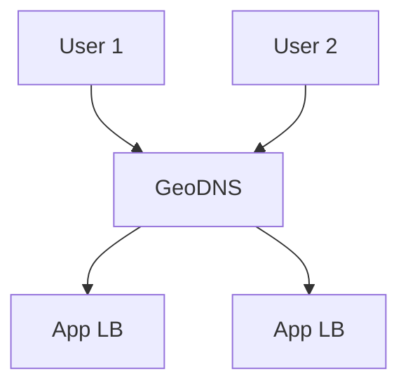
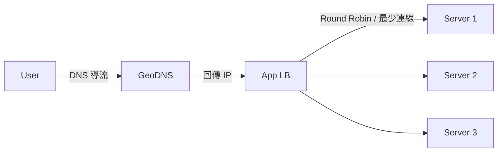
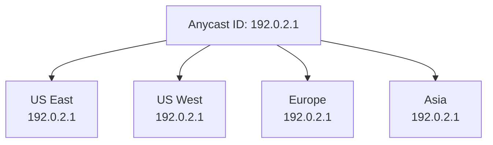
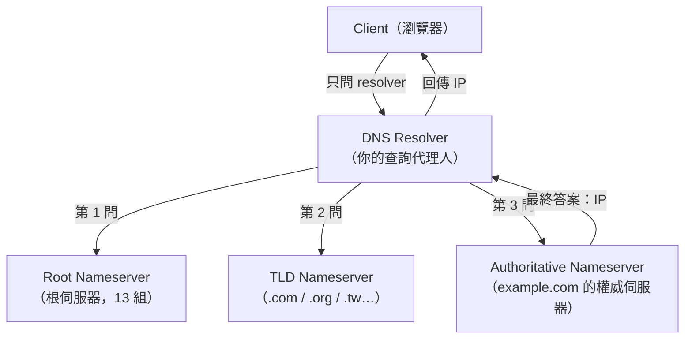
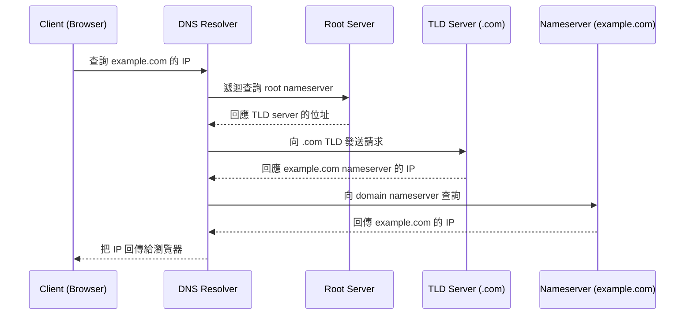
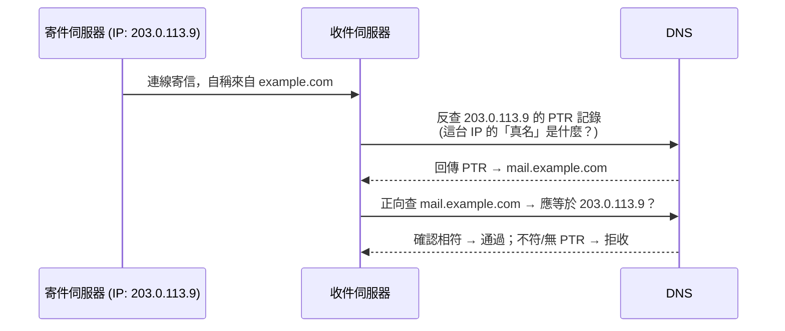

# DNS 負載平衡與解析流程

> 本篇涵蓋 **DNS Load Balancing（五種策略）**、**DNS + Application Load Balancer 架構**、**Anycast DNS**、**DNS 解析八步驟** 與 **Reverse DNS**，並補充各雲端廠商的對應實作。

---

# 一、內容總覽

| 主題 | 章節 |
|------|------|
| DNS Load Balancing 五種策略 | [二](#二dns-load-balancing) |
| DNS + App LB 架構圖 | [三](#三dns--application-load-balancer-架構) |
| Anycast DNS | [四](#四anycast-dns) |
| 雲端廠商實作 | [五](#五雲端廠商實作) |
| DNS 解析八步驟 | [六](#六dns-解析八步驟) |
| Reverse DNS | [七](#七reverse-dns) |

---

# 二、DNS Load Balancing

DNS 是流量進入系統的**第一道關卡**：使用者輸入網域名稱，DNS 決定要回傳哪一個伺服器 IP。DNS 負載平衡就是利用這個「回傳哪個 IP」的決定權，把流量分散到多台伺服器。

## 五大策略

1. **Round Robin DNS（輪詢 DNS）**
2. **Weighted Round-Robin（加權輪詢）**
3. **GeoDNS（地理負載平衡）**
4. **Latency Based Routing（延遲路由）**
5. **Health Based Routing（健康檢查路由）**

### I. Round Robin DNS（輪詢）

- 同一個網域名稱對應**多個 A 記錄**，DNS 回應時**輪流**回傳不同的 IP。
- 例：`example.com` 有三筆 A 記錄指向三台伺服器，第一筆查詢回 `A`，第二筆回 `B`，第三筆回 `C`，再回到 `A`……循環分配。
- **優點**：零成本、簡單，設定多筆記錄即可。
- **缺點**：
  - **無法感知伺服器狀態**：不會因為某台掛掉而跳過它，使用者仍會被導向壞掉的伺服器。
  - **不均勻**：流量透過各家 ISP 的 resolver 快取後，實際到達各台的流量不一定均勻。

    > **為什麼不均勻？（快取效應）**
    > Round Robin 只在 **DNS 伺服器回覆時**輪流給不同 IP，但真正到達各伺服器的流量未必會平均分配。原因是終端使用者通常不是直接查你的 DNS，而是由 **ISP / 企業的 resolver**（或瀏覽器、系統）先代理查詢；resolver 查到結果後會**快取一段時間（TTL）**。在 TTL 過期前，**所有透過這個 resolver 的使用者都會拿到同一個 IP**，流量因此被「**快取成一個區塊**」——某個 resolver 快取了 A，它底下幾千人都打到 A；另一個 resolver 快取了 C，它底下幾千人全打 C。所以 Round Robin 的「輪流」只在**查詢層級**有效，在**使用者流量層級**並不保證均勻。

    > **輪替機制細節：下一個 IP 不一定是 B**
    > Round Robin 的輪替是「**每一次到達權威伺服器的查詢**」就前進一格（A→B→C→A…），**不是每個 resolver 各記一個進度**。所以某個 resolver 在 TTL 到期後重新查詢時，拿到哪個 IP 取決於**那一刻全球所有查詢打到權威伺服器的次數**——可能是 B，也可能是 C 或又回到 A，沒有保證。而 TTL 到期瞬間，該 resolver 底下的使用者同時發請求，resolver 通常會**合併成一次上游查詢**，把單一回覆塞回快取，於是**整群人一起切到同一個新 IP**。這正是「不均勻」的另一面：不是平均分散，而是「一整個區塊的人一起切換」，切換當下可能對目標伺服器造成**同步流量尖峰（thundering herd）**。另外，很多 resolver 會在 TTL 到期**前**做背景預先刷新（prefetch / RFC 8767 serve-stale），不一定剛好到期才查；用戶端（瀏覽器/系統）也可能有自己的快取，實際更接近「一大群人都打同一個」。
  - **TTL 延遲**：用戶端與中間 resolver 會快取解析結果，DNS 變更需要等 TTL 過期才生效。

### II. Weighted Round-Robin（加權輪詢）

- 給每台伺服器一個**權重**（weight），權重愈高，被回傳的次數愈多。
- 例：`A` 權重 3、`B` 權重 1 → 每 4 次回傳，A 佔 3 次、B 佔 1 次。
- **用途**：各台機器**規格不同**（一台 8 核、一台 2 核）時，讓強的機器接更多流量。
- 本質上仍是 Round Robin 的改良版，**一樣無法感知健康狀態**。

### III. GeoDNS（地理負載平衡）

- 依據使用者來源**地理區域**，回傳最近的機房 IP。
- 例：亞洲使用者 → 回傳東京/新加坡機房；歐洲使用者 → 回傳法蘭克福機房。
- **判定方式**：一般透過使用者請求所經 **resolver 的 IP 位置**推測所在區域（resolver 通常與使用者在同一區域，但共享 resolver 可能造成誤判）。
- **優點**：降低跨區延遲、符合資料落地（data residency）法規。
- **缺點**：需要維運多個區域的機房與 DNS 紀錄管理。

### IV. Latency Based Routing（延遲路由）

- 以**實際測量到的網路延遲**為準，回傳「目前連線最快的機房」。
- **運作原理**：DNS 服務商事先量測**各區域 resolver ↔ 各機房**之間的延遲，建立延遲表；查詢時依 resolver 所在區域查表，回傳延遲最低的 IP。
- 比 GeoDNS 更精準：兩台機器即使在同一個地區，與使用者之間的網路路徑也可能不同。
- 代表實作：**Amazon Route 53 Latency Routing**、Google Cloud DNS 等。

### V. Health Based Routing（健康檢查路由）

- 在回傳 IP 前，先對各伺服器做**健康檢查**，只回傳狀態正常的伺服器。
- 檢查方式：HTTP/HTTPS 探測、TCP 連線測試、自訂字串比對等。
- **優點**：某台掛掉時自動被排除，使用者不會被導向死路。
- **注意**：健康檢查本身有**成本與延遲**，且 DNS 結果會被快取（TTL 期間仍可能命中已掛掉的機器），所以通常與 **App LB 的即時健康檢查**配合使用。

### 策略比較總表

| 策略 | 分配依據 | 感知健康狀態 | 實作成本 | 典型使用時機 |
|------|---------|:---:|:---:|------------|
| Round Robin | 輪流（順序） | ✗ | 極低 | 同等規格、無狀態服務 |
| Weighted Round-Robin | 權重 | ✗ | 低 | 異構機群（規格不同） |
| GeoDNS | 地理區域 | ✗ | 中 | 多區域部署、法規落地 |
| Latency Based Routing | 量測延遲 | ✗ | 中高 | 追求最低延遲的全球服務 |
| Health Based Routing | 健康檢查 | ✓ | 中高 | 需要自動故障轉移 |

---

# 三、DNS + Application Load Balancer 架構

> DNS 負責「把使用者導到哪個入口」，Application Load Balancer 負責「入口內要導到哪一台實際伺服器」——兩者分工合作。

- **User 1 / User 2**：終端使用者，輸入網域名稱。
- **GeoDNS**：依使用者區域決定回傳哪一個 App LB 的 IP。
- **App LB**（Application Load Balancer，可有多個）：接收流量後，再依內部規則（輪詢、最少連線、路徑/主機路由）轉發到後端伺服器群。

**設計重點：** DNS 只做到「**區域/入口層級**」的負載平衡，細粒度的健康檢查與流量分配交給 App LB。這樣分工讓 DNS 層保持簡單，又能享受 App LB 的即時健康檢查、SSL 終止、自動擴展等能力。

### I. App LB 是什麼？

App LB 是位於 DNS 之後、負責「**把進來的請求轉發到真正處理的那台伺服器**」的負載平衡器：

- **DNS 只決定「使用者連到哪個入口」**（一個 IP / 網域）。
- **App LB 接收入口流量後，決定「這筆請求轉給後端哪一台實體伺服器」**，並處理健康檢查、SSL 終止、水平擴展。

### II. App LB 實作舉例

| 情境 | App LB 實作 |
|------|------------|
| 自家架設 | Nginx、HAProxy、Traefik |
| AWS | Application Load Balancer（ALB）、NLB |
| GCP | Google Cloud Load Balancing |
| Azure | Azure Load Balancer、Application Gateway |
| Kubernetes | Ingress Controller（如 Nginx Ingress）、Service |

### III. AWS ALB 的具體例子

- 使用者連到 `app.example.com`（DNS 指向 ALB 的 IP）。
- 請求進 ALB 後，ALB 依 **路徑**（`/api/*` → API 群、`/web/*` → 前端群）或 **Host**（`admin.example.com` → 管理群）把流量導到對應目標群。
- ALB 每隔幾秒對後端做 **health check**，某台掛掉就自動移除，不再轉發過去。

---

# 四、Anycast DNS

> Anycast 讓**多個位置公告同一個 IP**，流量會自動路由到「距離最近」的那個位置。

- **概念**：世界各地的機房（US East / US West / Europe / Asia）**同時公告同一個 IP（例如 `192.0.2.1`）**。
- **路由依據**：流量會依 **BGP (Border Gateway Protocol) 路由** 送到「網路距離最近」的機房——Traffic routes to the nearest location based on BGP routing。
- **優點**：
  - **低延遲**：使用者自動連到最近節點。
  - **高可用**：某個節點斷線，BGP 收斂後流量自動轉到其他節點，**無需手動調整 DNS**。
  - **分散 DDoS**：攻擊流量被分散到全球節點，單點壓力減輕。
- **典型用途**：**權威 DNS 伺服器本身**（如 Cloudflare、Route 53 的 DNS 服務）、CDN、遊戲伺服器等。

> Anycast IP（例如 `192.0.2.0/24`）屬保留測試網段，範例僅作示意。

---

# 五、雲端廠商實作

| 廠商 | 服務 | 提供的 DNS 負載平衡能力 |
|------|------|------------------------|
| **Amazon Route 53** | Amazon Route 53 | Round Robin、Weighted、Latency、Geo（Geoproximity）、Health Check 全面支援 |
| **Cloudflare** | Cloudflare Load Balancing | 全球 Anycast 網路、地理/輪詢/加權、健康檢查、自動故障轉移 |
| **Google Cloud** | Google Cloud DNS | Round Robin、Geo（依 resolver 區域）、加權、健康檢查整合 |

---

# 六、DNS 解析八步驟

> 以 `example.com` 為例，從瀏覽器輸入網址到取得 IP 的完整流程。

## 0. 先認識登場角色（新手必讀）

### 前置關卡：查詢到底層的「完整順序」

在進入八步驟之前，瀏覽器的查詢其實會先被**四層快取/靜態檔**逐層攔截；只有全部都沒命中，才會走到「resolver 之後」的八步驟：

| 層級 | 位置/提供者 | 說明 |
|------|-----------|------|
| ① 瀏覽器快取 | Chrome / Firefox 等 | 瀏覽器自己記的解析結果，最快 |
| ② OS DNS 快取 | 作業系統（Windows DNS Client / macOS） | 系統層快取，`ipconfig /flushdns` 可清除 |
| ③ hosts file | `C:\Windows\System32\drivers\etc\hosts` 或 `/etc/hosts` | 靜態對照檔，**優先級最高**，寫死就繞過 DNS |
| ④ DNS Resolver | 通常由 **ISP** 提供，或手動設 `8.8.8.8` / `1.1.1.1` | 進入八步驟的起點 |
| ⑤ 八步驟 | 根 → TLD → 權威伺服器 | 真正向網際網路查詢 |

> **重點：** 八步驟描述的是「**resolver 接手之後**」的查詢鏈。實際使用時，多數查詢在 ①② 就命中了，根本不會走到 resolver；**除非 hosts file 有寫死**，否則 ①②③ 都只是「加速」用，不影響最終結果。而「 ISP 的 DNS 」就是第 ④ 層——它正是承接八步驟的那個 resolver。

## 1. 先認識登場角色（新手必讀）

DNS 的查詢由**四種角色**協力完成，它們像「**分層的電話簿**」：每層只知道自己下一層該找誰，層層往下轉，最後找到答案。

### ① Client（用戶端，你的瀏覽器）
- 你輸入網址的地方。它**不知道** `example.com` 在哪，只會把問題丟給 resolver。

### ② DNS Resolver（遞迴解析器）
- 像是「**你的查詢代理人**」，幫你跑完整個查詢流程（通常由你的 ISP 或 Google `8.8.8.8` / Cloudflare `1.1.1.1` 提供）。
- 它是唯一會「**跑完整條查詢鏈**」的角色，並會**快取結果**，讓後續查詢變快。
- 你只跟它打交道，其它層都由它代問。

### ③ Root Nameserver（根伺服器）
- 全世界只有 **13 組 root server**（用字母 `a-m` 命名，例如 `a.root-servers.net`），是 DNS 的「**最上層入口**」。
- 它**不直接知道** `example.com` 在哪，只回答一件事：**「你要找的 .com 是哪個 TLD 伺服器？」** 它像是目錄的「首頁」，指給你「下一步該翻哪一本」。
- **判定依據是「後綴（TLD）」**：root 看查詢網址的**最後一段**，回傳負責該後綴的 TLD 伺服器。例如查 `example.com` 看 `.com`、查 `example.tw` 看 `.tw`。它本質上就是一份「後綴 → TLD 伺服器」的總目錄（涵蓋約 1,500 多種 TLD），只做這件簡單的事，所以又快又可靠。

### ④ TLD Nameserver（頂層網域伺服器）
- 管理「最後一個點後面的網域」，例如 **`.com`**、`.org`、`.tw`、`.net`。
- `.com` 的 TLD 伺服器負責回答：**「.com 底下有沒有 example.com？有的話，它的 nameserver 是哪台？」**
- 它也不知道 `example.com` 的 IP，但它知道「誰負責管理 example.com」。

### ⑤ Authoritative Nameserver（權威伺服器 = 上文的 domain nameserver）
- 這才是**真正握有 `example.com` 最終答案**的伺服器，通常由**你購買網域的註冊商**（如 GoDaddy、Cloudflare、AWS Route 53）或你自架的 DNS 管理。
- 只有它能給出**最終的 IP 位址**（也就是 A 記錄）。

### 後綴（TLD）如何決定下一站——root 的判定依據

Root Nameserver 依查詢網址的 **最後一段（後綴）** 回傳對應的 TLD 伺服器：

| 查詢的網域 | 後綴（TLD） | root 會指到 |
|-----------|------------|------------|
| `example.com` | `.com` | .com TLD server |
| `example.org` | `.org` | .org TLD server |
| `example.tw` | `.tw` | .tw TLD server（台灣） |
| `example.co.jp` | `.jp` | .jp TLD server |

同理，下一步的 TLD server 也是**再看第二層名稱**（如 `example`）來回傳「負責 example.com 的權威伺服器」。

### 角色層級關係圖

> **一句話記法：** Client 只問 Resolver；Resolver 依序問「根 → TLD → 權威」三層，越問越接近答案，最後拿到 IP 回給 Client。

## 2. 八步驟流程圖

1. 使用者在瀏覽器輸入 `example.com`，查詢請求送到網際網路，由 **DNS resolver** 接收。
2. resolver **遞迴查詢** DNS **root nameserver**。
3. root server 回應 resolver **Top-Level Domain（TLD）伺服器**的位址。
4. resolver 向 **.com TLD** 發送請求。
5. TLD server 回應 **`example.com` nameserver** 的 IP 位址。
6. 遞迴 resolver 向 **domain nameserver** 查詢。
7. nameserver 把 `example.com` 的 IP 回傳給 resolver。
8. resolver 把最初請求的網域 IP 回傳給瀏覽器。

## 3. 用「分層電話簿」的比喻再看一次

- **第 1~2 步**：你跟助手（resolver）說「幫我查 example.com」。助手先打開電話簿首頁（root）。
- **第 3 步**：首頁告訴助手：「`.com` 的事要去問 `.com` 那本目錄（TLD）」。
- **第 4~5 步**：助手翻 `.com` 目錄，查到「`example.com` 的資料在**它的權威伺服器**那本」。
- **第 6~7 步**：助手去問權威伺服器，終於查到 `example.com` 的 IP。
- **第 8 步**：助手把 IP 回報給你（瀏覽器），接著瀏覽器才用這個 IP 去連網站。

## 4. 新手常見疑問

- **Q：為什麼要問那麼多層，不能直接查？**
  A：因為 DNS 是全球分散的資料庫，沒有單一一台伺服器能記住所有網域。分層讓每層只負責「知道下一層去哪裡找」，才能分散管理、容錯與擴展。
- **Q：resolver 每次都跑八步嗎？**
  A：不會。resolver 會**快取**每一層的答案（TTL 內有效），所以多數查詢在 resolver 那一層就結束了，甚至瀏覽器/作業系統也有自己的快取。
- **Q：root server 那麼少，會不會是瓶頸？**
  A：13 組只是「邏輯名稱」，實際背後有很多台機器 + Anycast 全球部署（呼應第四章），所以 root 查詢又快又可靠。

---

# 七、Reverse DNS

> **Reverse DNS（反向 DNS）**：給定一個 IP，查詢它對應的網域名稱——正好與一般「正向 DNS（Forward DNS，域名 → IP）」相反。

## I. 定義與原理

- **正向 DNS（Forward DNS）**：查詢網域 → 得到 IP（最常見）。
- **反向 DNS（Reverse DNS）**：查詢 IP → 得到網域。
- 反向解析**使用 `PTR` 記錄**（**Pointer Record，指標記錄**）。若伺服器**沒有設定 PTR 記錄**，就無法完成反向查詢。
- PTR 記錄放在反解專用的 `in-addr.arpa` 命名空間下，例如 IP `203.0.113.9` 的 PTR 記錄位於 `9.113.0.203.in-addr.arpa.`。

## II. 為什麼需要？——Email 伺服器的信任檢查

- Email 伺服器在收信前會檢查寄件者伺服器是否有效。
- 許多 Email 伺服器會**拒絕**來自以下來源的郵件：
  - **不支援反向查詢**的伺服器；或
  - **極不可能是合法來源**的伺服器（PTR 與連線來源明顯不符）。
- **用途**：透過反查 IP 是否對應到聲稱的寄件網域，判斷寄件伺服器真偽，阻擋垃圾郵件與偽造來源。

### 收信流程示意

垃圾郵件/釣魚郵件最大的特點之一是「**聲稱的身份與實際來源不符**」。例如一封信自稱是 `example.com` 寄的，但實際連線進來的 IP 根本不是 `example.com` 的伺服器，而是一台不知名的家用電腦或被駭的伺服器。收件伺服器收到「自稱來自 example.com」的信時，會做反向查證：

**檢查的兩件事：**
1. **有沒有 PTR 記錄**（能不能反查？）
2. **PTR 反查出來的網域名稱，跟寄件者聲稱的網域對不對得上**（真名是不是它自稱的那個？）

### 三種判定結果

| 情況 | 反查結果 | 收件伺服器判定 |
|------|---------|--------------|
| 正常企業伺服器 | PTR = `mail.example.com`，與聲稱相符 | ✓ 接受 |
| 無 PTR 記錄 | 反查失敗 | ✗ 極可疑 → 拒收 |
| PTR 與聲稱不符 | 反查出來是 `203-0-113-9.home.example.net`（家用動態 IP） | ✗ 明顯偽造 → 拒收 |

### 為什麼動態 IP 會被擋

家用/動態 IP 通常**沒有設定 PTR**（ISP 不會為每個家用用戶設反向記錄），且反查結果常是一串無意義的數字網址（如 `203-0-113-9.pool.dynamic.tp.com.tw`）。這種「**反查不出來 / 反查結果不像正經網域**」的來源，就是垃圾郵件的高風險特徵。

> **一句話總結：** PTR 反查 = 收件端用來「核對寄件伺服器身分」的信任檢查——寄件 IP 必須有對應的 PTR，而且反查出的網域要能自圓其說；否則就被當成高風險來源。這也解釋了為什麼「自有 Mail Server 一定要設 PTR」——不設，大信箱業者（Gmail/Outlook）很容易直接拒收。

## III. 實作要點

- 反解 IP 空間需要獨立的反向 DNS 管理（`in-addr.arpa`），通常由 **ISP / 雲端廠商**提供設定介面。
- 例：`1.2.3.4` 的 PTR 記錄建立於 `4.3.2.1.in-addr.arpa.` 底下。
- 若你經營自有 Mail Server，**務必**為寄件 IP 設定對應的 PTR 記錄，否則郵件可能被大型信箱服務（Gmail、Outlook 等）直接拒絕。

---

# 八、總結

- **DNS 是第一道負載平衡關卡**，用「回傳哪個 IP」來導流：輪詢 / 加權 / 地理 / 延遲 / 健康檢查。
- **DNS 層 + App LB 分工**：DNS 負責區域/入口層導流，App LB 負責入口內部的細粒度路由與即時健康檢查。
- **Anycast** 讓多個節點共用一個 IP，靠 BGP 自動路由到最近節點，兼顧低延遲與高可用。
- **DNS 解析八步驟** 是域名 → IP 的完整查詢流程，快取大幅降低實際查詢次數。
- **Reverse DNS（PTR 記錄）** 是郵件伺服器信任機制的基礎，自有 Mail Server 必須設定。
- 雲端環境直接採用 **Route 53 / Cloudflare Load Balancing / Google Cloud DNS**，內建上述多種策略。
