# 分散式系統的資料庫策略

> 本篇涵蓋五種分散式資料庫策略：**Single Database**、**Replication**、**Sharding**、**Replication + Sharding**、**NoSQL / Distributed Databases**，並附比較表、擴展路徑與 Dense / Sparse Index 補充。
> 以 **.NET / ASP.NET Core** 開發者的角度撰寫，含實作細節、C# 範例與架構陷阱。

---

# 一、內容總覽

## 1. 策略全覽圖

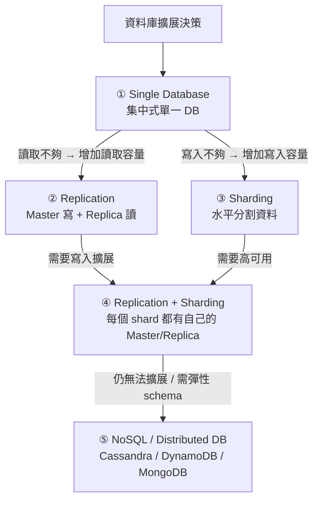

> **一句話總覽：** 資料庫策略是一條**逐步擴展**的路徑——先從單一 DB 開始，讀取不夠就加 Replication，寫入不夠就做 Sharding，兩者都要就結合，最後若仍無法擴展或需要彈性 Schema 才考慮 NoSQL。

---

# 二、Single Database（集中式單一資料庫）

## 1. 概念

- **所有資料都存在單一資料庫伺服器**，沒有 sharding、沒有 replication。
- 圖中表示：`Multiple Servers ↓ Single DB (Bottleneck)`——多台應用伺服器全部指向同一台 DB，這台 DB 就是瓶頸。

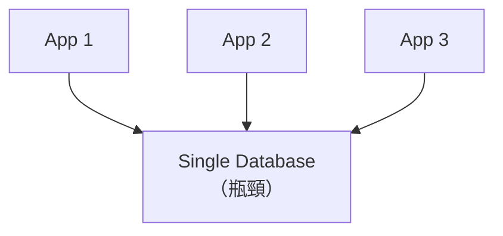

### I. 架構圖

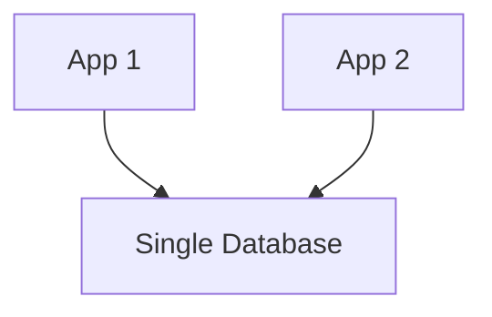

## 2. 優點（PROS）

| 優點 | 說明 |
|------|------|
| **實作與管理簡單** | 單一連線字串、單一備份、單一監控，維運成本最低 |
| **保證 ACID 交易** | 同一個 DB 內可完整支援 transaction，`BeginTransaction` / `COMMIT` / `ROLLBACK` 都是原子的 |
| **無一致性問題** | 只有一份資料，讀寫都看同一份，沒有 replica lag 或衝突 |
| **跨資料查詢容易** | JOIN 任意表格都行，不需跨庫聚合 |

## 3. 缺點（CONS）

| 缺點 | 說明 |
|------|------|
| **單點故障（SPOF）** | DB 掛掉 = 整個系統掛掉 |
| **擴展性受限** | 儲存空間與吞吐量都卡在一台機器 |
| **無法有效服務 1 億+ 使用者** | 吞吐量、連線數、記憶體都不夠 |
| **地理分散時延遲高** | 使用者在全球各地，都要打到同一個機房 |

## 4. 使用時機（WHEN TO USE）

- **Startup / MVP 階段（< 100 萬使用者）**
- 讀寫吞吐量需求低
- **強一致性（Strong consistency）至關重要**（例如金流、庫存）

## 5. 資深 .NET 開發者的實務考量

- **連接字串管理**：Single DB 時代，`appsettings.json` 裡的 `ConnectionStrings:DefaultConnection` 就是全部。切到多資料庫時，這條字串的拆解會是第一個要面對的重構。
- **別急著拆庫**：很多人一碰到效能問題就想拆庫，但其實「先垂直升級（scale up）+ 加 cache」往往更省成本。**Single DB 是用「時間」換「簡單」，當你需要規模時再升級，不要預先過度設計**。

---

# 三、HA Cluster 與 Read Replica（高可用與讀取擴展）

## 1. 兩種架構的差別

「Cluster」在實務上常被混用，其實指兩種**目的不同**的架構。關鍵差異在於 **Standby 是不是真的閒置**：

| | ① 一寫多讀（Read Replica） | ② Active/Standby（HA 主備切換） |
|---|---|---|
| **寫入** | 全部到 primary | 全部到 active（primary） |
| **讀取** | 分散到多台 replica（分擔讀流量） | 通常全部到 active；standby 不服務流量 |
| **Standby 狀態** | 同時收 WAL + 服務讀取 | 只收 WAL、待命 |
| **掛掉時** | 某台 replica 掛了，讀流量分給其他台 | active 掛了，**standby 接管變 primary**（failover） |
| **目的** | 擴展讀取吞吐、降低延遲 | 高可用（HA），不讓服務中斷 |

> **先澄清一個誤解：Standby 從來不是 idle（不做事）。** 就算它不服務任何讀取流量，它**每分每秒都在接收並套用 primary 傳來的變更**（PostgreSQL 靠 WAL 串流複製、MySQL 靠 binlog）。「Active db 一直將 insert/update 傳到 standby」正是 standby 持續收資料的機制。

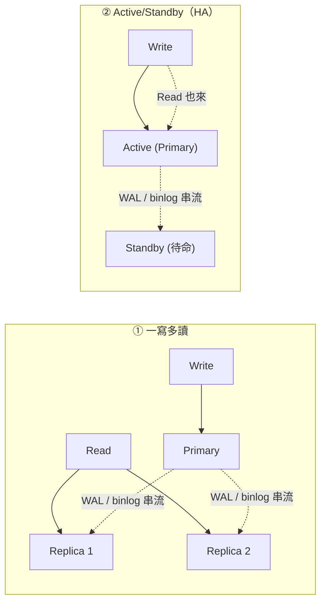

## 2. 兩者不是二選一，而是疊加

- **HA cluster**（②）解決「別掛掉」→ 1 台 active + 1 台 standby，standby 只待命。
- **Read scaling**（①）解決「讀不完」→ 在 HA 之上再掛多台 replica 分擔讀取。

大型系統常見的組合架構：

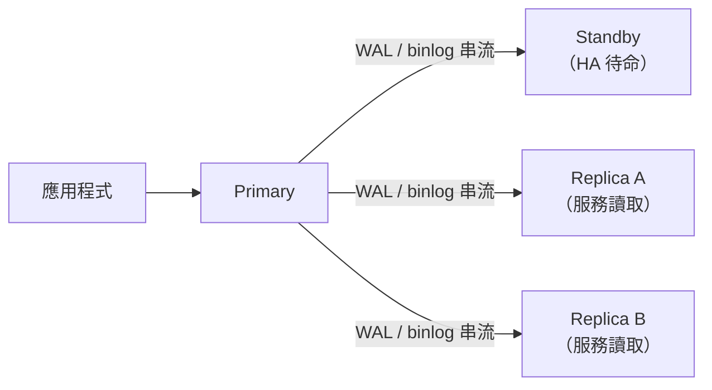

## 3. PostgreSQL 特別說明

它的 standby 其實兼具兩種能力（可開 `hot_standby` 同時服務讀取 + 待命切換），差別只在「要不要把讀流量導過去」。這也解釋了「連到 standby 卻執行 INSERT」為什麼會爆 `cannot execute INSERT in a read-only transaction`——standby 只能讀、不接寫入。

---

# 四、Replication（複寫，Master-Slave / Primary-Replica）

## 1. 概念

- **一個 Master（寫入）** + **多個 Replica（唯讀）**。
- Replica 透過 **binary log（binlog）** 從 Master 同步。
- 圖中表示：`Master (Write) ↓ Replicate ↓ Replica1 Replica2 (Read Only)`

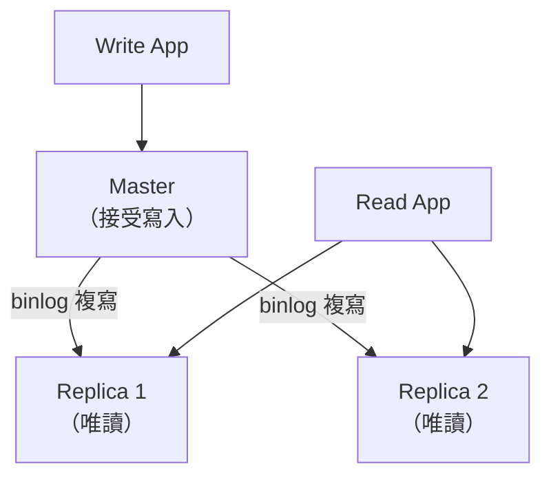

### I. 架構圖

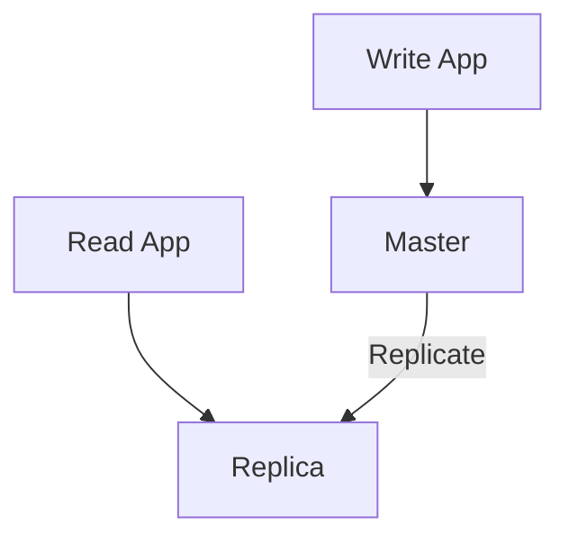

## 2. 優點（PROS）

| 優點 | 說明 |
|------|------|
| **擴展讀取容量** | Replica 分擔讀取，多台複本可服務更多並發讀 |
| **高可用** | Master 掛掉可 **failover** 到 replica |
| **降低延遲** | 讀取可導到最近的 replica（地理分散） |
| **備份現成** | Replica 本身就是即時備份來源 |

## 3. 缺點（CONS）

| 缺點 | 說明 |
|------|------|
| **複寫延遲（replication lag）** | Replica 資料是**最終一致**，剛寫完可能讀不到 |
| **寫入仍卡在 Master** | 所有寫入都打同一台，寫入吞吐受限 |
| **Master failover 複雜** | 切換主機有**資料遺失風險**（未複寫完的交易） |
| **不適合極端規模** | 寫入瓶頸最終還是會出現 |

## 4. 使用時機（WHEN TO USE）

- **讀取重的工作負載（80% 讀、20% 寫）**
- 需要地理分散讀取
- 可容忍**最終一致性**
- 規模可擴到 **1000 萬+ 使用者**

## 5. 資深 .NET 開發者的實務考量

### I. EF Core 的讀寫分離

```csharp
// 設定兩個連線字串：一個 master，一個或多個 replica
"ConnectionStrings": {
  "WriteDb": "Server=master.xxx;Database=AppDb;...",
  "ReadDb":  "Server=replica1.xxx;Database=AppDb;..."
}
```

```csharp
public class ReadWriteDbContext : DbContext
{
    private readonly string _readConnectionString;
    private readonly string _writeConnectionString;

    public ReadWriteDbContext(
        DbContextOptions<ReadWriteDbContext> writeOptions,
        string readConnectionString) : base(writeOptions)
    {
        _readConnectionString = readConnectionString;
    }

    // 讀取用 replica（唯讀），寫入用 master
    public IQueryable<T> Read<T>(DbSet<T> set) where T : class
    {
        // 切換到唯讀連線（需搭配 Proxy 或 factory 實作）
        return set.AsNoTracking();
    }
}
```

> 實務上常見做法：用 **路由層（proxy 或 DbContextFactory 選擇連線）**，讀查詢走 replica、寫查詢走 master。**陷阱：同一個 request 內先寫後讀**，若讀走了 replica，可能讀不到自己剛寫的資料（replica lag）——需要「寫後強制走 master 讀」或「寫後 sleep 一小段」。

### II. 經典陷阱：複寫延遲造成的「寫後讀不到」

```csharp
// 使用者提交表單後立刻重新導向到列表頁
await _db.Orders.AddAsync(order);
await _db.SaveChangesAsync();          // 寫入 master

// 下一秒列表頁從 replica 讀——可能讀不到剛新增的訂單！
var orders = await _readDb.Orders.ToListAsync();
```

**解法**：
1. **Session / Cookie 標記**：寫入後標記「此使用者最近有寫入」，近期讀取強制走 master。
2. **短暫延遲**：寫入後等一小段（如 50~100ms）再讓該使用者讀 replica。
3. **只在可接受最終一致的查詢走 replica**。

---

# 五、Sharding（水平分割 / 分片）

## 1. 概念

- 依 **shard key**（例如 `user_id`）把資料**分割到多個資料庫**，每個 shard 持有部分資料。
- 圖中表示：`User ID 1-10M Shard 1`、`User ID 10M-20M Shard 2`；架構圖為 `App (Shard Logic)` 依規則導向不同 shard。

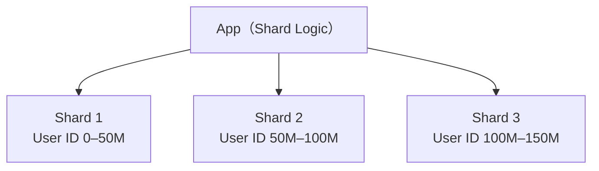

### I. 架構圖

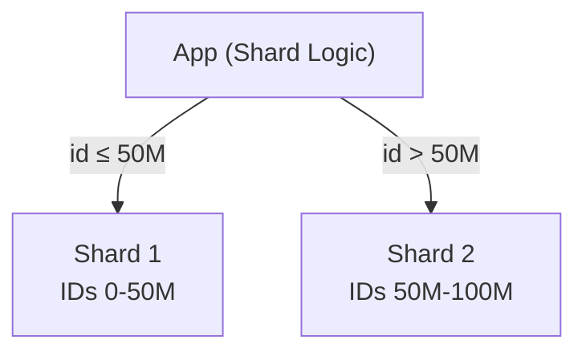

## 2. 優點（PROS）

| 優點 | 說明 |
|------|------|
| **讀寫都可擴展** | 不只是讀，**寫入**也能分散到多台 |
| **每台資料變少 → 查詢變快** | 單 shard 資料量小，索引更小、掃描更快 |
| **可服務 1 億+ 使用者** | 水平加機器即可 |
| **天生分散** | 分散式架構的基礎 |

## 3. 缺點（CONS）

| 缺點 | 說明 |
|------|------|
| **實作與管理複雜** | 路由邏輯、維運都變複雜 |
| **跨 shard 查詢困難** | 需要聚合（fan-out + merge） |
| **重新分片（resharding）困難** | 規模再大時要搬資料，有 downtime / 複雜度 |
| **資料熱點（hotspot）** | 選錯 shard key 會讓流量集中到單一 shard |
| **無法跨 shard 交易** | 分散式交易極困難 |

## 4. 使用時機（WHEN TO USE）

- 大規模系統（**1 億+ 使用者**）
- **寫入重**的工作負載
- 資料**天然可分割**
- 能設計出**好的 shard key**

> 特別註記：**"Shard by high cardinality"**——shard key 應選擇**基數高（high cardinality）**的欄位，才能讓資料均勻分散，避免熱點。

## 5. 資深 .NET 開發者的實務考量

### I. Shard key 的選擇原則

- **高基數（high cardinality）**：值種類要多（如 user_id），不能用 `IsActive`（只有 true/false）這種。
- **分散均勻**：hash / 範圍都能用，但要避免「熱門 key」集中。
- **符合查詢模式**：shard key 最好就是**最常查詢的條件**（例如「依使用者查」就用 user_id）。

### II. 一致性 Hash（Consistent Hashing）示意

```csharp
// 概念：用 hash(user_id) 決定打到哪個 shard
public static int GetShardId(long userId, int shardCount)
{
    // 避免直接 mod 造成熱點不均，實務常用一致性 hash 或 virtual node
    return (int)((ulong)userId % (ulong)shardCount);
}
```

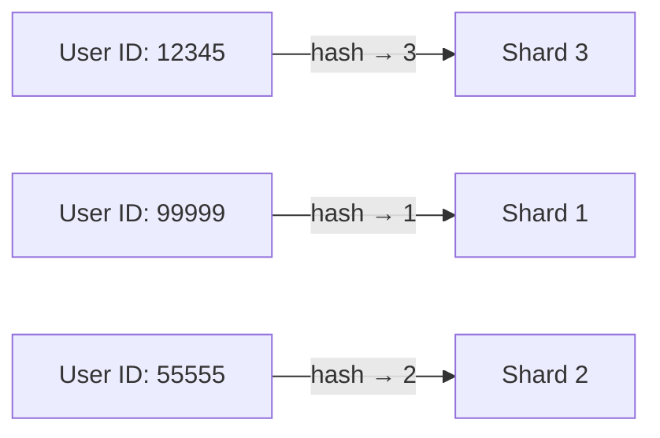

### III. 一致性 Hash 演算法（C#）

```csharp
using System;
using System.Security.Cryptography;
using System.Text;

/// <summary>
/// 一致性 hash：新增/移除節點時，只會影響少量 key 的重新分配，
/// 避免「直接 mod」在節點數量變動時全數 key 搬家。
/// </summary>
public sealed class ConsistentHash
{
    private readonly SortedDictionary<uint, string> _ring = new();
    private readonly int _virtualNodes = 100;   // 每台機器虛擬節點數

    public void AddNode(string node)
    {
        for (int i = 0; i < _virtualNodes; i++)
        {
            var hash = Hash($"{node}#{i}");
            _ring[hash] = node;
        }
    }

    public string GetNode(string key)
    {
        if (_ring.Count == 0) throw new InvalidOperationException("ring is empty");
        var hash = Hash(key);
        // 找第一個 >= hash 的節點；找不到就繞回第一個
        foreach (var kv in _ring)
        {
            if (kv.Key >= hash) return kv.Value;
        }
        return _ring[_ring.Keys[0]].Value;
    }

    private static uint Hash(string input)
    {
        using var sha = SHA256.Create();
        var bytes = sha.ComputeHash(Encoding.UTF8.GetBytes(input));
        return BitConverter.ToUInt32(bytes, 0);
    }
}
```

> **陷阱**：資料庫的 sharding 通常比 cache 層更難搬，因為**資料是持久化的**。設計時要想清楚：範圍式（range）sharding 容易熱點，hash 式（consistent hashing）均勻但範圍查詢難。

---

# 六、Replication + Sharding（組合策略，Production Scale）

## 1. 概念

- **每個 shard 都有自己的 Master + Replica**。結合兩者優點，是「最佳解」。
- 圖中表示：`Shard 1 Master → Replica`、`Shard 2 Master → Replica`；架構圖為 `App (Intelligent Routing)` 依規則導向對應 shard 的 master。

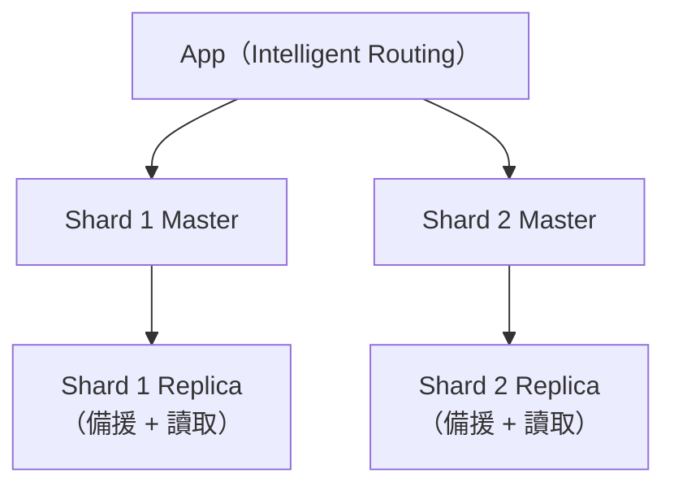

### I. 架構圖

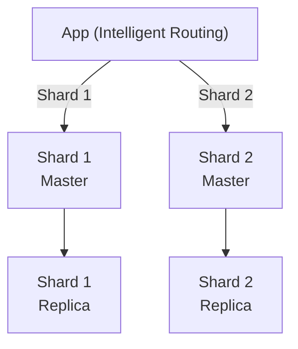

## 2. 優點（PROS）

| 優點 | 說明 |
|------|------|
| **讀寫都可擴展** | sharding 擴寫入、replication 擴讀取 |
| **高可用** | 每個 shard 的 replica 就是備援 |
| **地理分散** | 本地讀、寫入 master |
| **1 億+ 使用者 + 高可用** | 巨量規模的業界標準 |
| **大型系統的標準做法** | Facebook、Twitter、Google 皆此模式 |

## 3. 缺點（CONS）

| 缺點 | 說明 |
|------|------|
| **維運最複雜** | 多 shard × 多 replica 的組合，監控與維運成本最高 |
| **基礎設施成本最高** | 機器數量最多 |
| **重新分片困難** | 搬 shard 資料最痛苦 |
| **監控與維護複雜** | 每個節點的狀態、複寫延遲都要盯 |

## 4. 使用時機（WHEN TO USE）

- 大型生產系統（**1 億–10 億使用者**）
- 需要**高可用 AND 擴展**
- 能承擔營運複雜度
- 需要地理分散
- **範例：Facebook、Twitter、Google**

## 5. 資深 .NET 開發者的實務考量

- **連線管理**：每個 shard 的 master/replica 是不同的連線字串，需要一個 **connection registry / routing table** 管理。
- **交易範圍**：跨 shard 交易基本上不可行，業務要**設計成單 shard 內可完成**（例如用 user_id 當 shard key，讓單一使用者的資料都在同一個 shard）。
- **拆分的演進路徑**：不要一步到位。先 Single DB → 掛 Replica → 加 Cache → 真的寫入卡住了再 sharding → 最後再每個 shard 加 replica。**過早 sharding 是很多系統的失敗主因。**

---

# 七、NoSQL / Distributed Databases（分散式資料庫）

## 1. 概念

- 從設計第一天就**為分散而生**的資料庫，內建 replication 與 sharding。
- 代表：**Cassandra**（Netflix）、**DynamoDB**（AWS）、**MongoDB**（通用）。
- 圖中表示：`Cassandra Cluster Node1 ↔ Node2 ↔ Node3 (Ring topology)`。

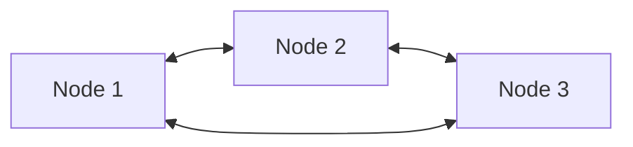

> 這是 **Ring topology（環狀拓撲）**：節點彼此相連，資料依 hash 分布在環上，任一點掛掉都由相鄰節點接手。

### I. 架構圖

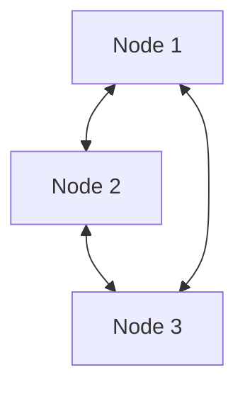

## 2. 優點（PROS）

| 優點 | 說明 |
|------|------|
| **從根基就為分散設計** | 不需要事後補 sharding |
| **自動 sharding 與 replication** | 內建 |
| **水平擴展** | 加節點即可，**不需重新分片** |
| **高可用** | 多節點共識（consensus） |
| **彈性 Schema（NoSQL）** | 欄位可動態變化 |

## 3. 缺點（CONS）

| 缺點 | 說明 |
|------|------|
| **跨節點無 ACID** | 用 BASE 取代 ACID |
| **最終一致性** | 可能讀到舊資料 |
| **維運與調校複雜** | 節點管理、tuning 都要功力 |
| **查詢模型不同** | 沒有 SQL join |
| **需要資料重複 / 反正規化** | 為查詢模式設計 schema，避免 join |

## 4. 使用時機（WHEN TO USE）

- 需要**超大規模 + 高可用**
- 可容忍**最終一致性**
- 彈性 / 演進中的資料模型
- 需要高吞吐量
- **範例：Cassandra（Netflix）、DynamoDB（AWS）、MongoDB（通用）**

## 5. 資深 .NET 開發者的實務考量

### I. .NET 使用範例（以 MongoDB 為例）

```csharp
// MongoDB Driver for .NET
using MongoDB.Driver;

var client = new MongoClient("mongodb://localhost:27017");
var db = client.GetDatabase("appdb");
var users = db.GetCollection<User>("users");

// 依 _id（MongoDB 內建 shard key）分散，水平擴展加節點即可
var user = new User { Id = Guid.NewGuid().ToString(), Name = "Alice" };
await users.InsertOneAsync(user);

var found = await users.Find(u => u.Id == user.Id).FirstOrDefaultAsync();
```

### II. 什麼時候不該用 NoSQL？

- **需要強一致性的交易**（訂單、庫存、金流）→ 留在 SQL + 單一/複寫架構。
- **大量 join 查詢** → NoSQL 會逼你重複儲存資料，反而增加一致性複雜度。
- **還沒有規模問題** → 先不要，**「僅在 sharding 仍不足時才用 NoSQL」**（呼應 Key Insights 第 4 點）。

---

# 八、比較表、擴展路徑與關鍵洞見

## 1. 比較表（COMPARISON TABLE）

| 策略 | 可擴展性 | 一致性 | 可用性 | 複雜度 | 成本 | 使用時機 |
|------|:---:|:---:|:---:|:---:|:---:|---------|
| **Single DB** | 低 | 強（Strong） | 低 | 低 | 低 | MVP、新創 |
| **Replication** | 中 | 最終一致（Eventual） | 中 | 中 | 中 | 讀取重、< 1000 萬 |
| **Sharding** | 高 | 強（Strong） | 低 | 高 | 中 | 大規模、寫入重 |
| **Replication + Sharding** | 非常高 | 最終一致 | 高 | 非常高 | 高 | 1 億+ 使用者、需 HA |
| **NoSQL / Distributed** | 非常高 | 最終一致 | 高 | 高 | 中 | 極端規模、彈性 schema |

> **注意表內關鍵差異：**
> - **Single DB 與 Sharding 一致性標示為「Strong」**——sharding 每筆資料仍只存在單一 shard（無複本），所以該筆資料強一致；但跨 shard 查詢/交易則不行。
> - **Replication 系（含組合）是「Eventual」**——因為 replica 有複寫延遲。

## 2. 擴展路徑（SCALE PROGRESSION）

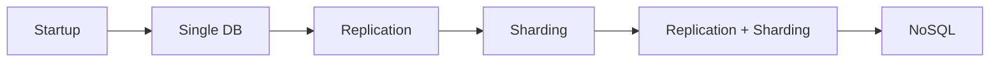

> **路徑：Startup → Single DB → Replication → Sharding → Replication + Sharding → NoSQL**

## 3. 關鍵洞見（KEY INSIGHTS）

1. **先簡單（Single DB），按需擴展**——不要預先過度設計。
2. **Replication = 擴展讀取；Sharding = 擴展寫入。**
3. **組合策略同時獲得讀寫擴展 + 高可用（最佳解）。**
4. **NoSQL 增加複雜度，僅在 sharding 仍不足時才用。**

---

# 九、總結

- **資料庫策略是漸進式的**：Single DB → Replication → Sharding → Replication + Sharding → NoSQL。
- **Replication 擴讀取、Sharding 擴寫入**，組合策略同時獲得讀寫擴展與高可用，是大型系統的標準解。
- **選型關鍵**：規模、一致性需求、寫入/讀取比例、可接受的複雜度與成本。
- **NoSQL 是最後手段**——除非 sharding 真的不足，否則不要引入額外複雜度。
- **索引補充**：Dense index 快但貴（每列一條），Sparse index 省但慢（部分列 + 掃頁），選擇取決於查詢頻率與記憶體預算。

> **資深 .NET 開發者速記：**
> - MVP 用 Single DB，別過度設計。
> - 讀取重 → 上 Replica（記得處理「寫後讀不到」的 replica lag）。
> - 寫入卡住 → 上 Sharding（shard key 選高基數欄位）。
> - 兩者都要 + 要高可用 → Replication + Sharding（每個 shard 自帶 replica）。
> - 換 NoSQL 前，先確認真的無法靠 sharding 解決。
