# 負載平衡（Load Balancer）完整指南

> 本篇涵蓋負載平衡的**演算法**、**部署策略**、**健康檢查**、**Session 持久化**與**最佳實踐**，並附演算法比較表。
> 以 **.NET / ASP.NET Core** 開發者的角度撰寫，含 C# 實作細節、架構考量與實務陷阱。

---

# 一、內容總覽

負載平衡器（Load Balancer）位於「使用者」與「後端伺服器群」之間，負責把流量**平均分散**到多台伺服器，讓系統可水平擴展並保持高可用。

## 1. 核心架構

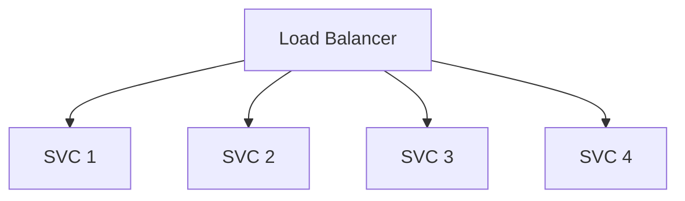

- **LB**：單一入口，接收所有流量，依演算法分發到後端。
- **SVC 1~4**：後端服務實例（可水平擴展），各自處理一部分請求。

## 2. 本篇涵蓋的六大主題

1. **負載平衡演算法**（7 種）：Round Robin、Sticky、Weighted RR、IP Hash、Least Connections、Lowest Response Time、Layer 4 vs Layer 7。
2. **部署策略**（4 種）：Single LB、HA Pair、Active-Active、Geographic LB。
3. **健康檢查**：TCP Probe、HTTP/HTTPS、Passive Checks、Heartbeat Interval。
4. **Session 持久化**：Cookie-based、IP-based、Distributed Session Store。
5. **演算法比較表**：複雜度、公平性、狀態、適用場景。
6. **最佳實踐**：CDN、Connection Pooling、Circuit Breaker、Rate Limiting、Monitoring、Graceful Degradation。

---

# 二、負載平衡演算法（LOAD BALANCING ALGORITHMS DETAILED）

## 1. Round Robin（輪詢）

- **依序**把請求分發到每台伺服器（A→B→C→A→B→C…）。
- **公平**，但**不考慮伺服器目前負載**。
- **最適合**：各台伺服器 **容量相同（uniform server capacity）** 的情境。

### I. 特性

| 特性 | 說明 |
|------|------|
| 複雜度 | O(1) |
| 公平性 | Perfect（輪流） |
| 負載感知 | None |
| 有狀態 | 無 |

### II. C# 實作（簡單輪詢計數器）

```csharp
public sealed class RoundRobinBalancer
{
    private readonly string[] _servers;
    private int _next;

    public RoundRobinBalancer(string[] servers) => _servers = servers;

    public string Next()
    {
        // Interlocked.Increment 保證多執行緒安全
        var index = Interlocked.Increment(ref _next) % _servers.Length;
        return _servers[index];
    }
}
```

> **陷阱**：`_next % length` 在無狀態、無共用計數器時，多個 LB 節點各自計數會造成分配不均——所以 Round Robin 常需要**共享狀態**（Redis 計數）或靠 LB 單一節點維運。

## 2. Sticky / Session Affinity（黏著性）

- **同一個用戶固定打到同一台伺服器**（為了保存 session state）。
- 用 **cookie** 或 **IP-based** 識別用戶。

### I. 特性

| 特性 | 說明 |
|------|------|
| 複雜度 | O(1) |
| 公平性 | Perfect（仍輪流） |
| 負載感知 | None |
| 有狀態 | **Yes**（保存 session） |

### II. C# / ASP.NET Core 實作考量

```csharp
// ASP.NET Core 的 session 若是 In-Process，就要靠 sticky 才能確保同一用戶命中同一節點
builder.Services.AddSession(options =>
{
    options.Cookie.Name = ".AspNetCore.Session";
    options.IdleTimeout = TimeSpan.FromMinutes(20);
});
builder.Services.AddDistributedMemoryCache();
```

> **陷阱**：Sticky 會破壞負載均衡的均勻性，且節點掛掉時該節點上的 session 全部遺失。**微服務時代建議用分布式 session store 取代**（見第五章）。

## 3. Weighted Round Robin（加權輪詢）

- 依**伺服器容量**分配權重。
- **權重 3 的伺服器收到權重 1 的 3 倍流量**。

### I. 特性

| 特性 | 說明 |
|------|------|
| 複雜度 | O(1) |
| 公平性 | 依權重（不完美但合理） |
| 負載感知 | 容量感知（靜態） |
| 有狀態 | 無 |

### II. C# 實作（權重輪詢）

```csharp
public sealed class WeightedRoundRobinBalancer
{
    private readonly (string Server, int Weight)[] _servers;
    private int _current = -1;
    private int _weightUsed;

    public WeightedRoundRobinBalancer((string, int)[] servers) => _servers = servers;

    public string Next()
    {
        while (true)
        {
            _current = (_current + 1) % _servers.Length;
            if (_current == 0)
            {
                _weightUsed--;
                if (_weightUsed <= 0)
                {
                    _weightUsed = _servers.Max(s => s.Weight);
                }
            }
            if (_servers[_current].Weight >= _weightUsed)
            {
                return _servers[_current].Server;
            }
        }
    }
}
```

> **使用時機**：當後端是**異構機器**（一台 8 核、一台 2 核）時，讓強的機器接更多流量。

## 4. IP Hash（IP 雜湊）

- **Hash 用戶端 IP** 決定送到哪台伺服器。
- **保證同一用戶每次打到同一台**，適合**有狀態應用（stateful apps）**。

### I. 特性

| 特性 | 說明 |
|------|------|
| 複雜度 | O(1) |
| 公平性 | Good（hash 分布） |
| 負載感知 | Client IP |
| 有狀態 | 無（但效果等同 sticky） |

### II. C# 實作

```csharp
public sealed class IPHashBalancer
{
    private readonly string[] _servers;

    public IPHashBalancer(string[] servers) => _servers = servers;

    public string GetServer(string clientIp)
    {
        // 對 IP 做 hash，再對伺服器數量取模
        var hash = clientIp.GetHashCode() & 0x7fffffff; // 避免負數
        return _servers[hash % _servers.Length];
    }
}
```

> **陷阱**：伺服器數量改變（新增/移除節點）會讓**大量用戶重新分配**，session 會全部失散。要平滑，需用**一致性 hash（consistent hashing）**（詳見 Database Strategies 篇）。

## 5. Least Connections（最少連線）

- 把請求導到**目前活躍連線最少**的伺服器。
- **動態**、能**適應真實負載**。
- **更適合長連線**（WebSocket、串流）。

### I. 特性

| 特性 | 說明 |
|------|------|
| 複雜度 | O(log n)（依連線數排序） |
| 公平性 | Good |
| 負載感知 | Real-time（即時連線數） |
| 有狀態 | Yes（需追蹤連線數） |

### II. C# 實作（連線計數）

```csharp
public sealed class LeastConnectionsBalancer
{
    private sealed class ServerState
    {
        public string Host;
        public int Connections;
    }

    private readonly ServerState[] _servers;
    private readonly object _lock = new();

    public LeastConnectionsBalancer(string[] hosts)
        => _servers = hosts.Select(h => new ServerState { Host = h }).ToArray();

    public string Acquire()
    {
        lock (_lock)
        {
            // 找連線數最少的伺服器
            var target = _servers.OrderBy(s => s.Connections).First();
            target.Connections++;
            return target.Host;
        }
    }

    public void Release(string host)
    {
        lock (_lock)
        {
            _servers.First(s => s.Host == host).Connections--;
        }
    }
}
```

## 6. Lowest Response Time（最低回應時間）

- 導到**回應時間最快**的伺服器（依活躍連線數加權）。
- **最聰明**，但**需要持續監控**。

### I. 特性

| 特性 | 說明 |
|------|------|
| 複雜度 | O(log n) |
| 公平性 | Excellent |
| 負載感知 | Real-time |
| 有狀態 | Yes |

### II. 概念

```csharp
// 概念：分數 = 平均回應時間 × (活躍連線數 + 1)
var score = server.AverageResponseTime * (server.ActiveConnections + 1);
var target = servers.OrderBy(s => score).First();
```

> **運作原理**：同時考慮「這台快不快」與「這台忙不忙」，把請求導到「快又不太忙」的那台。適用於後端**負載不均（heterogeneous）**的環境。

## 7. Layer 4 vs Layer 7（第四層 vs 第七層）

| 面向 | Layer 4（TCP/UDP） | Layer 7（HTTP/HTTPS） |
|------|-------------------|----------------------|
| 路由依據 | **封包標頭（IP + TCP/UDP Port）** | **內容感知**（URL path、Hostname、HTTP Headers） |
| 速度 | 快 | 較慢（需解讀內容） |
| 複雜度 | 簡單 | 較複雜 |
| 適用 | **非 HTTP 協定** 或 **超低延遲** | HTTP/HTTPS，需依路徑/主機路由 |
| 例子 | HAProxy L4 mode、AWS NLB | NGINX、AWS ALB、HAProxy L7 mode |

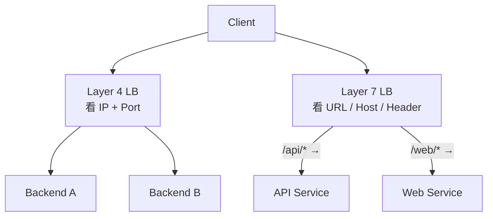

> **資深開發者提醒**：Layer 7 才能做**路徑路由**（同一網域導到不同服務）、**SSL 終止**、**HTTP 快取**。但每多一層解析就是多一層延遲與成本。

---

# 三、負載平衡器部署策略（LOAD BALANCER DEPLOYMENT STRATEGIES）

## 1. Single LB（單一負載平衡器）

- 一台 LB 處理所有流量。
- **簡單**，但**產生單點故障（single point of failure）**。
- **非生產等級**（not production-ready）。

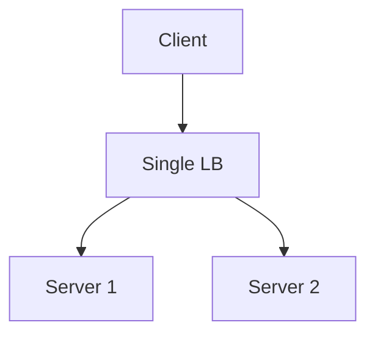

> **結論**：只能在開發/測試環境用，上線前一定要有 HA。

## 2. HA Pair（Active-Passive 高可用對）

- **兩台 LB**，靠 **heartbeat（心跳）** 互相監測。
- **Active 掛掉時，Passive 立刻接管**。
- 使用 **VIP（Virtual IP）**——用戶只連 VIP，由 active 對應。

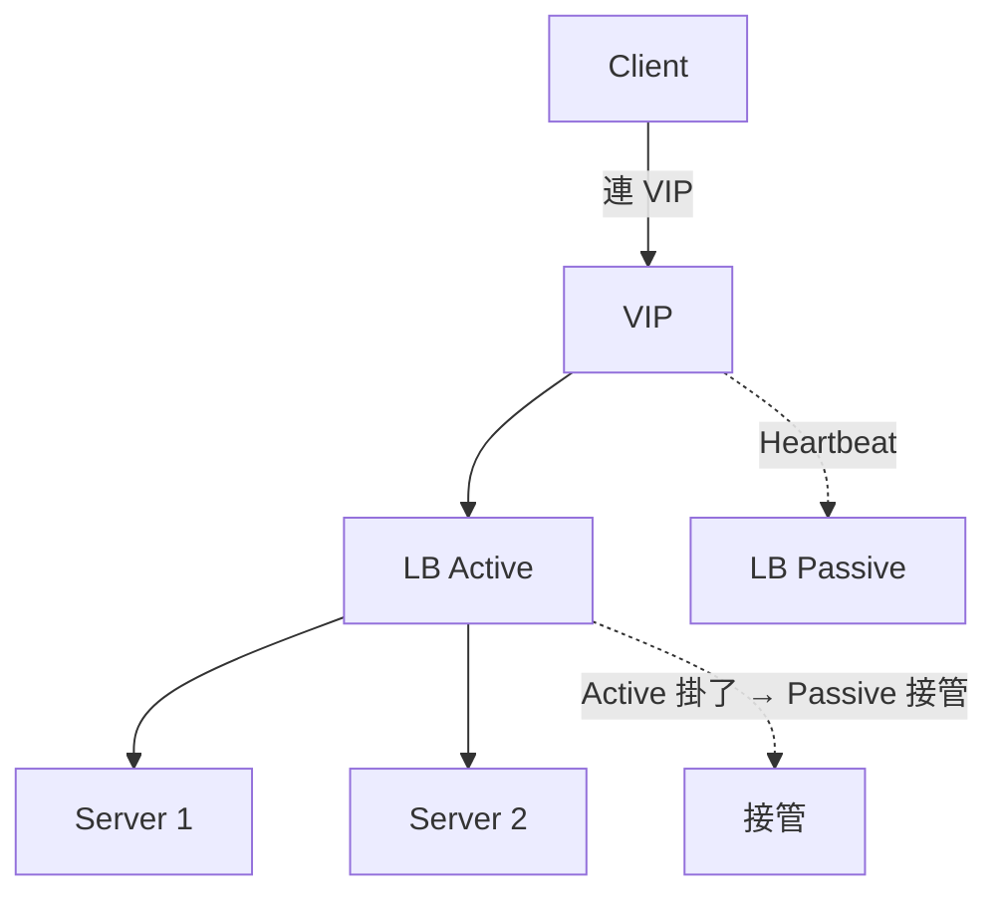

| 項目 | 說明 |
|------|------|
| 可用性 | 高（自動故障轉移） |
| 閒置資源 | Passive 通常閒置（成本浪費） |
| 代表性 | Keepalived、雲端 LB（如 AWS ALB 內建 HA） |

### I. 心跳（Heartbeat）機制詳解

> **先釐清一個常見誤解：VIP 不會發心跳包。** 心跳是**兩台 LB 之間**互相發送的，VIP 只是個「浮動 IP」，本身不會主動做任何事——它只會被某台 LB 綁定。

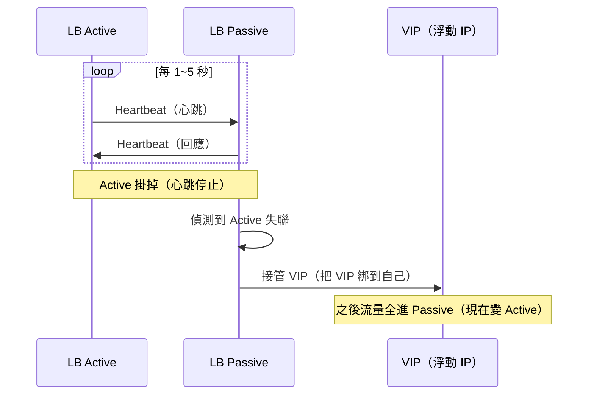

| 角色 | 做什麼 |
|------|--------|
| **LB Active** | 把 VIP 綁在自己身上，處理流量；**持續發心跳**給 Passive |
| **LB Passive** | 監聽 Active 的心跳；**正常時不碰流量** |
| **VIP（Virtual IP）** | 只是個**被綁定**的 IP，本身不會發任何東西 |

#### i. 完整接管流程

1. **Active 定時發心跳**給 Passive（通常每 1~5 秒，依 `vrrp_interval` 設定）。
2. Passive 收到 → 確認 Active 活著，自己繼續待命。
3. **Active 掛了 → 心跳停止**。
4. Passive 等過 `master_down_delay`（如 3~5 秒）都沒收到 → 判定 Active 掛了。
5. Passive **把 VIP 綁到自己**（透過 ARP 廣播宣告「VIP 現在是我的」）→ 流量開始進來。

#### ii. 誰負責發心跳？——VRRP / Keepalived

實作上靠 **VRRP**（Virtual Router Redundancy Protocol）或 **Keepalived**：

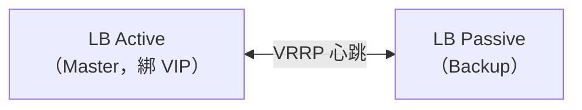

- **Keepalived / VRRP**：兩台都安裝，主動的一方當 Master 綁住 VIP，Backup 監聽心跳。這是「**誰握有 VIP**」的仲裁機制——**心跳是機器之間的協定，與 VIP 本身無關**。

#### iii. Passive 會回應 Active 的心跳嗎？——單向 vs 雙向

**要看是哪一層的心跳**，實務上有兩層意義：

**① VRRP 層級（決定誰當 Master）——單向為主**

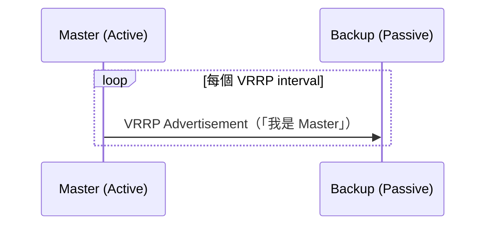

- Master **主動廣播 Advertisement**（宣告自己活著），Backup **只聽不答**。
- 這是單向的——Backup 不需要回 VRRP 給 Master。
- 原因：VRRP 的設計是「**Master 主動宣示、Backup 被動等待超時**」。Master 不需要知道 Backup 活不活著，因為 Backup 沒接流量，死了也不影響服務。

**② 應用層雙向心跳（互相健康探測）——雙向**

若兩台 LB 之間**另外設了雙向健康檢查**（例如各自呼叫對方 `/health`、或 HAProxy 之間的自訂心跳），那確實是**互相發送、互相回應**：

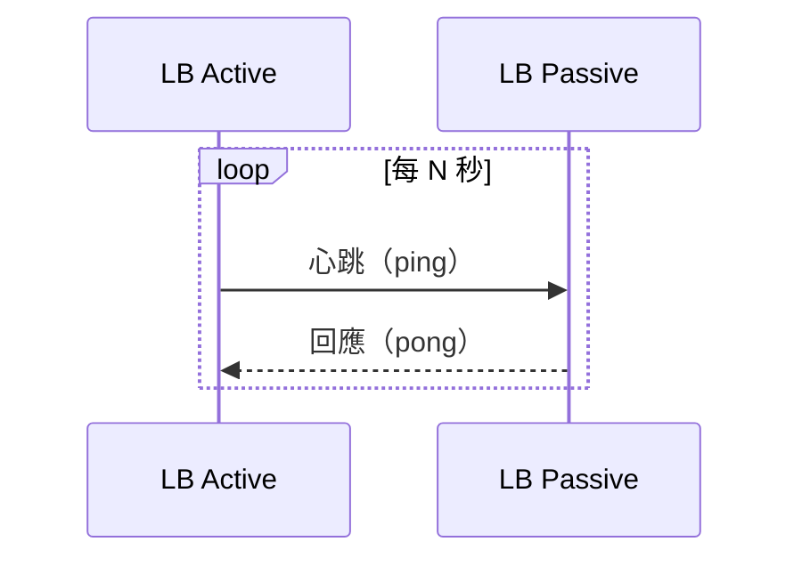

| 面向 | VRRP（單向） | 雙向心跳 |
|------|------------|---------|
| 目的 | 決定誰握 VIP | 兩台都確認彼此健康 |
| 必要性 | Backup 不需要回 | 需要 |
| 後果 | Backup 死了也不影響服務 | 雙向才知道彼此狀態 |

> **關鍵：** VIP 的接管是 **靠 Backup「偵測 Master 心跳超時」** 來觸發，**不是靠 Master 收到回應**。所以就算 Master 完全不管 Backup 有沒有回，failover 依然能運作。

> **一句話總結：** 心跳是「兩台 LB」彼此探測，不是「VIP 探測 LB」。VIP 只是個浮動 IP，誰心跳贏了（Master），誰就把 VIP 綁到自己身上。最核心的 VRRP 機制裡，心跳是「Master 單向宣示、Backup 只聽」；若另外設了雙向健康檢查，Passive 才會回應 Active。

## 3. Active-Active（多台同時運作）

- **多台 LB 同時處理流量**。
- 靠 **DNS round-robin** 或 **Anycast** 分配。
- 需要 **session replication** 或 **sticky sessions**（否則同一用戶打到不同 LB，session 遺失）。

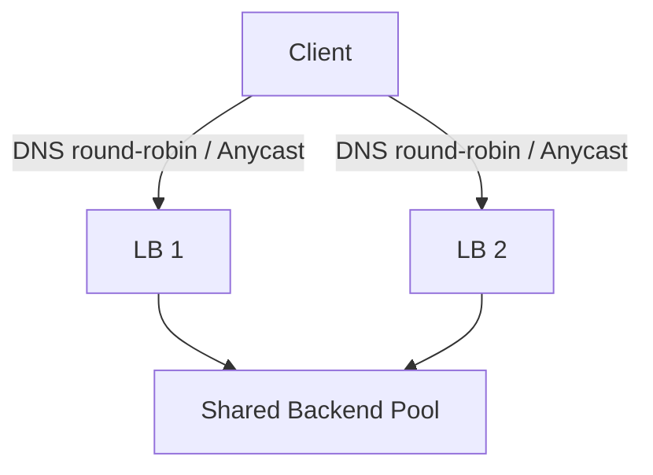

| 項目 | 說明 |
|------|------|
| 吞吐量 | 多台同時出力（無閒置） |
| 複雜度 | 需 session 同步 |
| 代表性 | 雲端多 zone LB、Anycast DNS |

## 4. Geographic LB（地理負載平衡）

- **把用戶導到最近的資料中心**。
- 優點：**低延遲**、符合**資料落地法規**（compliance）。
- 使用 **GeoDNS**。

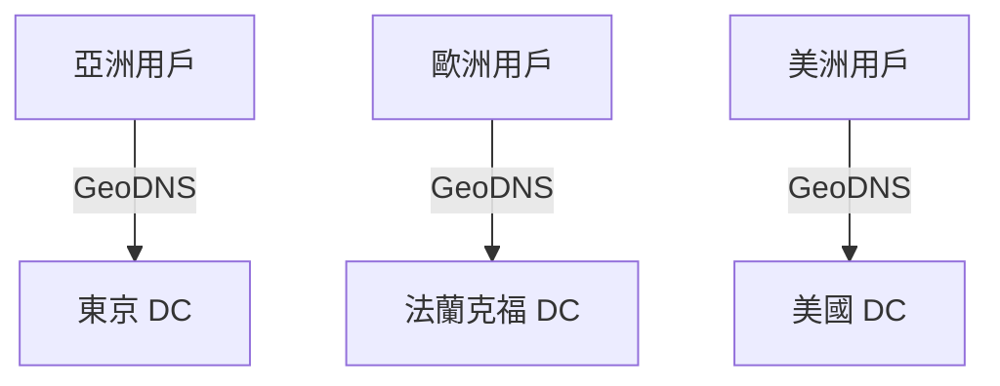

> 詳細機制請見「DNS 篇」的 GeoDNS 章節。

---

# 四、健康檢查（HEALTH CHECKS）——高可用的關鍵

> 健康檢查是負載平衡器**判斷後端是否活著**的機制。沒有健康檢查，LB 就會把流量送給壞掉的伺服器。

## 1. TCP Probe（TCP 探測）

- **輕量、快速**。
- 只檢查**埠號是否開啟**。
- **不驗證服務是否真的健康**（port 開著不代表 service 正常）。

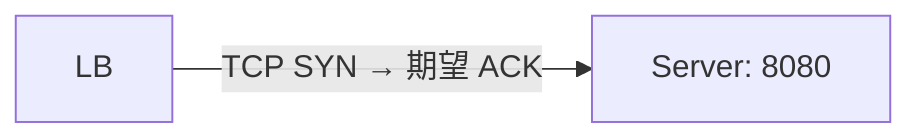

## 2. HTTP / HTTPS（HTTP 健康檢查）

- 打 **`GET /health`** 端點。
- 可以**檢查依賴**（DB、cache）是否正常。
- 依**狀態碼**判斷：**200 = 健康**、**503 = 生病（sick）**。

### I. ASP.NET Core 的 Health Checks 實作

```csharp
// Program.cs
builder.Services.AddHealthChecks()
    .AddDbContextCheck<AppDbContext>("database")          // 檢查 DB 連線
    .AddRedis("redis:6379", "cache");                    // 檢查 Redis

var app = builder.Build();
app.MapHealthChecks("/health");                          // GET /health 回 200/503
app.Run();
```

```csharp
// 後端程式可針對不同依賴設計不同健康狀態
app.MapHealthChecks("/health/ready", new HealthCheckOptions
{
    Predicate = _ => true,   // readiness：檢查所有依賴
});
app.MapHealthChecks("/health/live", new HealthCheckOptions
{
    Predicate = _ => false,  // liveness：只確認進程活著
});
```

> **最佳實踐**：
> - `/health/live`（liveness）：只要進程活著就回 200——適合給「要不要重啟容器」判斷。
> - `/health/ready`（readiness）：要連依賴（DB/Redis）都正常才回 200——適合給 LB「要不要把流量送過來」判斷。
> - 兩者分開，才能避免「DB 抖一下就被重啟」或「依賴壞了還在接流量」。

## 3. Passive Checks（被動檢查）

- **監控錯誤率與回應時間**。
- **即時偵測效能劣化**（degradation），而不是等主動探測失敗。

| 指標 | 意義 |
|------|------|
| 錯誤率上升 | 服務正在出錯 |
| 回應時間上升 | 服務負載過高/卡住 |
| 逾時 | 服務可能已掛 |

## 4. Heartbeat Interval（心跳間隔）

- 典型 **5~10 秒**。
- **間隔愈短**：**更快偵測**，但**更多探測開銷**。
- **間隔愈長**：**較少開銷**，但**故障轉移較慢**。

```csharp
// ASP.NET Core 也可用 BackgroundService 自行發心跳
public sealed class HeartbeatWorker : BackgroundService
{
    protected override async Task ExecuteAsync(CancellationToken ct)
    {
        while (!ct.IsCancellationRequested)
        {
            using var client = new HttpClient();
            try
            {
                var resp = await client.GetAsync("https://db.example.com/health", ct);
                // 記錄心跳結果
            }
            catch { /* 心跳失敗 → 記錄 */ }
            await Task.Delay(TimeSpan.FromSeconds(5), ct);  // 5 秒間隔
        }
    }
}
```

---

# 五、Session 持久化 / 黏著性（SESSION PERSISTENCE / STICKINESS）

> 當應用需要保存 **使用者狀態（session）** 時，必須決定「同一用戶如何打到同一台伺服器」或「如何讓 session 不依賴單一伺服器」。

## 1. Cookie-based（Cookie 黏著）

- **LB 設定 cookie**，內含「伺服器 ID」。
- 瀏覽器下次請求**自動帶上 cookie**，LB 依 cookie 導向同一台。
- **跨瀏覽器可用**，但**不安全**（客戶端可修改）。

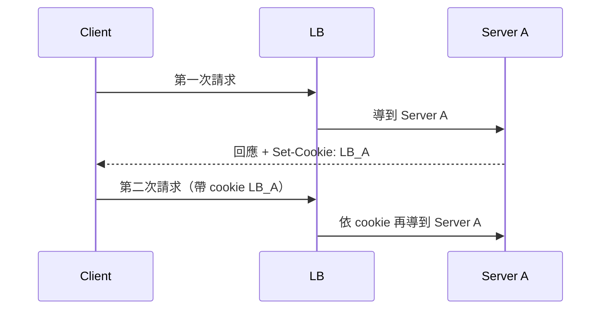

> **陷阱**：cookie 可被使用者修改 → 要對 cookie 做**簽章**（HMAC），防止用戶竄改伺服器 ID。

## 2. IP-based（IP Hash 黏著）

- **Hash 用戶端 IP** 決定伺服器。
- **簡單**，但**共享 Proxy IP**（公司 NAT）或**行動用戶**（IP 一直換）會出問題。

| 情境 | 問題 |
|------|------|
| 公司 NAT（所有人同一個外網 IP） | 全部綁到同一台伺服器，負載不均 |
| 行動用戶（IP 一直變） | 每次請求都跳到不同伺服器，session 遺失 |

## 3. Distributed Session Store（分散式 Session 儲存）

- 把 session 存在 **Redis / Memcached**。
- **不需要黏著性**（無需 affinity）。
- **伺服器無狀態（stateless）**。
- **微服務的推薦做法**。

### I. ASP.NET Core 完整實作（Redis 分散式 Session）

分五步，以 .NET 7+ / ASP.NET Core 為例：

**① 安裝套件**

```bash
dotnet add package Microsoft.Extensions.Caching.StackExchangeRedis
```

> Session 本身在 `Microsoft.AspNetCore.Session`（ASP.NET Core 內建）；分散式快取用 `Microsoft.Extensions.Caching.StackExchangeRedis`。

**② 註冊 Redis 做分散式快取**

```csharp
// Program.cs
builder.Services.AddStackExchangeRedisCache(options =>
{
    options.Configuration = "redis:6379";        // Redis 連線字串
    options.InstanceName = "MyApp:";             // 所有 key 的前綴，避免跟其他 app 撞
});
```

- `Configuration`：Redis 位址，可含密碼、叢集設定（如 `redis:6379,password=xxx,ssl=true`）。
- `InstanceName`：**必設**。多個 app 共用同一台 Redis 時，用前綴隔離（`MyApp:...`、`OtherApp:...`）。

**③ 註冊 Session（改用分散式儲存）**

```csharp
builder.Services.AddSession(options =>
{
    options.Cookie.Name = ".AspNetCore.Session";
    options.IdleTimeout = TimeSpan.FromMinutes(20);
});
```

關鍵：**加了 `AddStackExchangeRedisCache` 之後，`AddSession` 自動改用 Redis 當儲存**——不需要再 `AddDistributedMemoryCache()`。Session 背後的 `IDistributedCache` 就是 Redis 了。

**④ 啟用中介層**

```csharp
var app = builder.Build();
app.UseRouting();
app.UseSession();      // 必須在 UseRouting 之後、MapControllers 之前
app.MapControllers();
```

**⑤ 使用 Session（程式碼完全不用改）**

```csharp
public class CartController : Controller
{
    public IActionResult AddToCart()
    {
        var count = HttpContext.Session.GetInt32("CartCount") ?? 0;
        HttpContext.Session.SetInt32("CartCount", count + 1);
        return Ok(count + 1);
    }
}
```

**驗證真的存到 Redis**

```bash
redis-cli
> KEYS *MyApp*            # 看到 MyApp:xxx 就代表存進 Redis 了
1) "MyApp:3279c4b2-...f"  # session ID 為 key
```

#### i. Session 設定的逐行解釋

```csharp
builder.Services.AddSession(options =>
{
    options.Cookie.Name = ".AspNetCore.Session";
    options.IdleTimeout = TimeSpan.FromMinutes(20);
});
```

| 設定 | 意義 |
|------|------|
| `AddSession(...)` | 註冊 Session 服務到 DI 容器（要先裝 `Microsoft.AspNetCore.Session`） |
| `options.Cookie.Name` | 設定 Session cookie 的名字，瀏覽器上會看到這個 cookie |
| `options.IdleTimeout` | **閒置逾時**：使用者 20 分鐘沒有任何動作，session 就失效 |

**運作原理：**

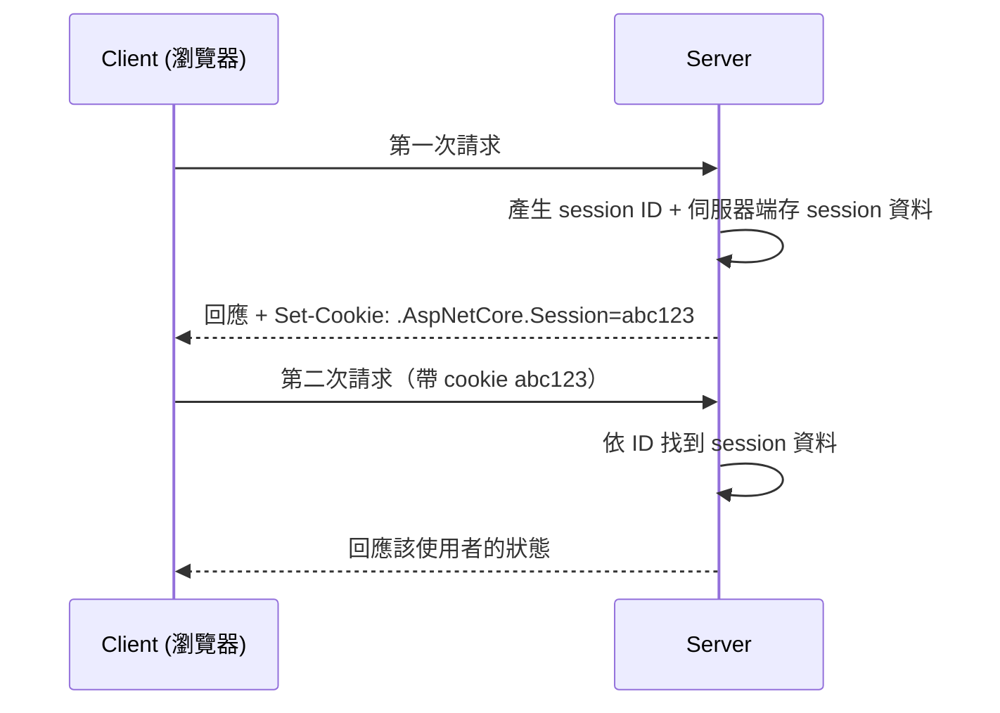

- **Cookie 只存「session ID」**（一個隨機字串），真正資料存在**伺服器端**。
- 瀏覽器每次請求自動帶上 cookie → 伺服器認得「這是同一個人」。

**三個重點：**
1. 一定要呼叫 `app.UseSession()`，且要在 `UseRouting` 之後。
2. `IdleTimeout` 是「閒置」不是「絕對」——連續操作不會被登出，只有完全沒動作超過時間才失效。
3. 預設 Session 存在「本機記憶體」（`AddDistributedMemoryCache`），伺服器重啟就遺失、多台伺服器互不相通；改用 Redis 後就無狀態了。

#### ii. Server B 如何從 Redis 讀 session？（程式碼看不出來的原因）

關鍵：**「Server B 從 Redis 讀」在程式碼裡其實「看不到」**，它是靠 ASP.NET Core 的**中介層（middleware）自動完成**的。你只做兩件事：註冊（`AddStackExchangeRedisCache`）＋啟用（`app.UseSession()`），讀寫 Redis 的細節都被框架藏起來了。

`UseSession` 中介層在**每個請求**進入時自動做：

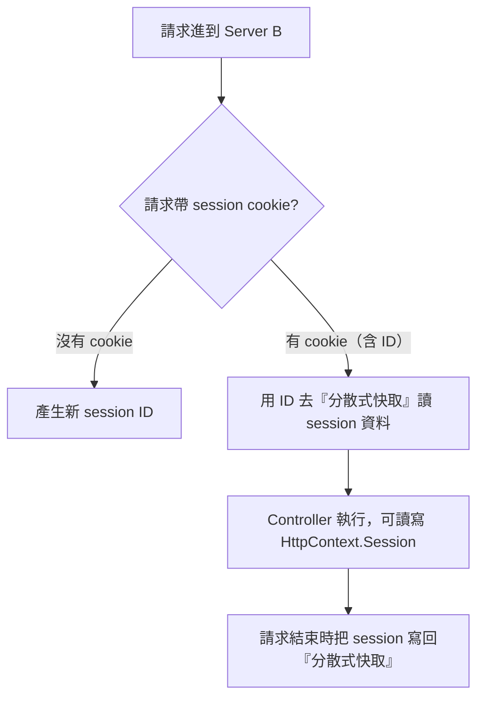

而「分散式快取」是誰？就是你在 `AddStackExchangeRedisCache` 註冊的那個 **Redis**。

**關鍵：`IDistributedCache` 抽象**

ASP.NET Core 的 Session 不直接「知道」Redis，它只依賴一個抽象介面 `IDistributedCache`：

```csharp
public interface IDistributedCache
{
    byte[]? Get(string key);
    Task<byte[]?> GetAsync(string key, CancellationToken token = default);
    // ... Set / Remove ...
}
```

你註冊的是**哪個實作**，Session 就會用哪個來讀寫：

| 你註冊的 | Session 實際存哪 |
|---------|----------------|
| `AddDistributedMemoryCache()` | 本機記憶體 |
| `AddStackExchangeRedisCache()` | **Redis** |
| 其他（SQL Server、NCache…） | 對應儲存 |

Session 的程式碼永遠是同一份，**換儲存只要換註冊那一行**。這就是為什麼 Server A 和 Server B 的程式碼完全相同，卻能共用同一份 session——因為大家都去同一個 Redis 讀寫。

**想親眼看到 Server B 在讀 Redis？用 Redis MONITOR：**

```bash
redis-cli MONITOR
```

當 Server B 收到請求時，會看到：

```
1652... "GET" "MyApp:3279c4b2-5f1a-4c2e-8c3a-9a6f2b1c8d4e"
1652... "SETEX" "MyApp:3279c4b2-5f1a-4c2e-8c3a-9a6f2b1c8d4e" "1200" "\x1F..."
```

- `GET MyApp:<session-id>` = Server B **從 Redis 讀** session。
- `SETEX ... 1200` = 請求結束**寫回**並設 20 分鐘（1200 秒）TTL。

#### iii. Server B 拿到 session 資料後，能做什麼？

先釐清：**Server B 用 session ID 從 Redis 拿到的不是「ID」，而是「ID 背後的資料」**。ID 只是查詢的鑰匙，真正用的是它指向的內容。

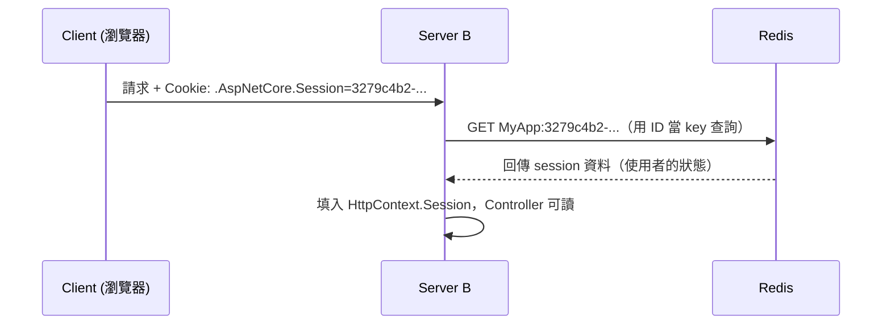

假設使用者之前在 Server A 存了狀態，現在同一使用者的請求打到 Server B：

```csharp
public IActionResult Cart()
{
    var username = HttpContext.Session.GetString("Username");   // "Alice"
    var count    = HttpContext.Session.GetInt32("CartCount");   // 3
    var loggedIn = HttpContext.Session.GetString("IsLoggedIn"); // "true"

    // 用途一：認得這個人（不用重新登入）
    if (loggedIn != "true") return Redirect("/login");

    // 用途二：恢復他的狀態（購物車內容）
    return View(new CartViewModel { Items = count, User = username });
}
```

**白話：** 使用者「前一個請求存進 Session 的狀態」，在 Server B 上也完整存在——Server B 就像「接續同一個使用者」繼續服務，使用者完全無感換了台機器。

**如果沒有分散式 Session（沒去 Redis 讀）會怎樣？**
- Server B 收不到資料 → `GetString("Username")` 回 null → 使用者**被當成陌生人**。
- 購物車空了、登入狀態沒了 → **掉 Session**，這正是為什麼要用 Redis。

#### iv. Session 的資料結構：Dictionary 還是 KV？

要區分**兩個層次**，因為「KV」在兩邊長得不一樣：

**① 應用程式層：Session 是一個 KV 集合（Dictionary 概念）**

```csharp
// ISession 介面的本質：Dictionary<string, byte[]>
public interface ISession
{
    void Set(string key, byte[] value);
    bool TryGetValue(string key, out byte[] value);
    IEnumerable<string> Keys { get; }
}
```

```csharp
HttpContext.Session.SetInt32("CartCount", 3);   // key="CartCount", value=3(序列化成 byte[])
HttpContext.Session.SetString("Username", "Alice");  // key="Username", value="Alice"
```

| 項目 | 內容 |
|------|------|
| Key | `"CartCount"`、`"Username"`（你自訂的 string） |
| Value | 序列化後的位元組（byte[]） |

**② 儲存層（Redis）：整個 Session 是一個 value**

你設的那些 KV **不會各存成 Redis 的一個 key**——整個 Session 內容被**打包成一份資料**，以「session ID」當 key，存成**一個** Redis 條目：

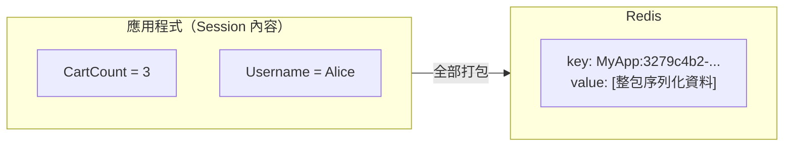

```
Redis 裡的 KV：
  key   = MyApp:<session-id>          ← 只有一個 key
  value = 整個 Session 的序列化內容    ← 你所有設定的東西都塞在這裡面
```

> **一句話總結：** 應用程式層 Session 是 `Dictionary<string, byte[]>`（一個 session 裡多個 KV）；Redis 層是一個 session = 一個 KV（key 是 session ID，value 是整包資料）。存取時：程式寫多個 KV → 中介層打包成一份 → 存進 Redis 單一 key；讀取時反過來拆開。這也代表單一 session 有大小上限（Redis string 最大 512MB，實務建議控制在 KB 級），別把大資料塞進 session。

> **為什麼是微服務推薦做法**：session 存 Redis 後，任何節點都能服務任何用戶，節點可以自由增刪、水平擴展，壞一台也不影響任何 session——**不再需要 sticky session**。

---

# 六、演算法比較表（ALGORITHM COMPARISON TABLE）

| 演算法 | 複雜度 | 公平性 | 感知 | 有狀態 | 適用場景 |
|--------|:---:|:---:|------|:---:|---------|
| **Round Robin** | O(1) | Perfect | None | 無 | 容量均勻的伺服器 |
| **Sticky RR** | O(1) | Perfect | None | **有** | 需保存 session 狀態 |
| **IP Hash** | O(1) | Good | Client IP | 無 | 有狀態應用 |
| **Least Connections** | O(log n) | Good | Real-time | 有 | 長連線（WebSocket） |
| **Lowest Response Time** | O(log n) | Excellent | Real-time | 有 | 負載不均的後端 |

---

# 七、建議與最佳實踐（RECOMMENDATIONS & BEST PRACTICES）

## 1. 靜態內容用 CDN

- **Cloudflare、Akamai** 分擔靜態內容流量，**降低 origin 負載**。

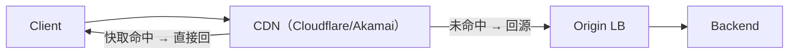

## 2. Connection Pooling（連線池）

- **LB 對後端維持持久連線**，**降低延遲**（省去每次重新建立連線的握手成本）。

```csharp
// ASP.NET Core 側也應啟用 HttpClient 連線池（預設即複用連線）
builder.Services.AddHttpClient("api")
    .ConfigurePrimaryHttpMessageHandler(() =>
        new SocketsHttpHandler
        {
            PooledConnectionLifetime = TimeSpan.FromMinutes(5),
            MaxConnectionsPerServer = 100
        });
```

## 3. Circuit Breaker（斷路器）

- **防止連鎖故障（cascading failures）**。
- 後端不健康時**暫時停止路由到該伺服器**，讓它恢復。

```csharp
// 使用 Polly（微軟官方建議的斷路器套件）
builder.Services.AddHttpClient("backend")
    .AddPolicyHandler(Policy.Handle<HttpRequestException>()
        .CircuitBreakerAsync(
            handledEventsAllowedBeforeBreaking: 3,   // 連續 3 次失敗
            durationOfBreak: TimeSpan.FromSeconds(30)));  // 斷路 30 秒
```

## 4. Rate Limiting（速率限制）

- **LB 限制每個用戶的請求速率**，**防止 DDoS**。

```csharp
// ASP.NET Core 7+ 內建速率限制
builder.Services.AddRateLimiter(options =>
{
    options.AddFixedWindowLimiter("per-client", limiter =>
    {
        limiter.PermitLimit = 100;
        limiter.Window = TimeSpan.FromMinutes(1);
        limiter.QueueLimit = 10;
    });
});
app.UseRateLimiter();
```

## 5. Monitoring & Logging（監控與日誌）

- **追蹤請求分布、延遲、錯誤率**。
- 用量度指標：**p50、p95、p99 延遲**。

```csharp
// 簡易指標計算（p95 = 95% 請求都在此值以下）
var latencies = GetRequestLatencies();   // 例如從 DB / 日誌收集
latencies.Sort();
var p50 = latencies[(int)(latencies.Count * 0.50)];
var p95 = latencies[(int)(latencies.Count * 0.95)];
var p99 = latencies[(int)(latencies.Count * 0.99)];
```

## 6. Graceful Degradation（優雅降級）

- 所有伺服器都過載時，**放棄部分流量或減少功能**，而不是整個掛掉。

| 手法 | 說明 |
|------|------|
| Shed load | 拒絕次要流量，保住核心功能 |
| Reduce features | 停用非關鍵功能（如推薦演算法） |
| Return 503 | 明確告知過載，讓 LB 退避 |

## 7. 真實世界的 LB 選擇

| 情境 | 選擇 |
|------|------|
| 雲端（AWS） | **ELB / ALB / NLB** |
| 雲端（Google） | **Google Cloud Load Balancer** |
| 雲端（Azure） | **Azure Load Balancer / Application Gateway** |
| 自架 | **HAProxy**、**NGINX Plus** |

---

# 八、總結

- **負載平衡器是把流量分散到多台後端的入口**，LB → SVC1~4 的架構是水平擴展的基礎。
- **演算法選擇取決於後端特性**：容量均勻用 Round Robin；異構機器用 Weighted RR；長連線用 Least Connections；要 session 用 Sticky / IP Hash；負載不均用 Lowest Response Time。
- **Layer 4 快而簡單、Layer 7 靈活而慢**，需要路徑/內容路由時選 Layer 7。
- **部署策略**：Single LB 只適合開發；生產至少 HA Pair（VIP + heartbeat），大型系統用 Active-Active 或 Geographic LB。
- **健康檢查是高可用的靈魂**：TCP Probe 快但淺、HTTP `/health` 深但慢，建議 `/live` + `/ready` 分開。
- **Session 優先選分散式儲存（Redis）**，讓伺服器無狀態，就不需要 sticky session。
- **最佳實踐**：CDN、連線池、斷路器、速率限制、監控（p50/p95/p99）、優雅降級缺一不可。

> **資深 .NET 開發者速記：**
> - 你的 API 若是無狀態 → **Round Robin 或 Least Connections**，不需要 sticky。
> - 有 session 需求 → **先試 Redis 分散式 session**，別急著開 sticky。
> - Health check 一定要分 `/live`（進程活著）與 `/ready`（依賴正常）。
> - 用 Polly 斷路器 + 內建 Rate Limiter，別等故障發生才補。
