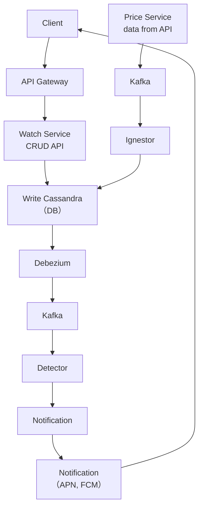
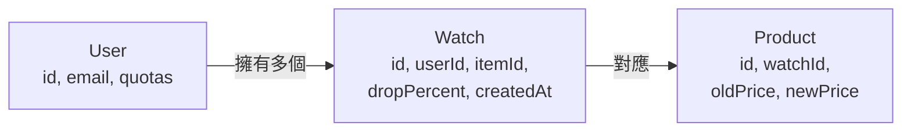
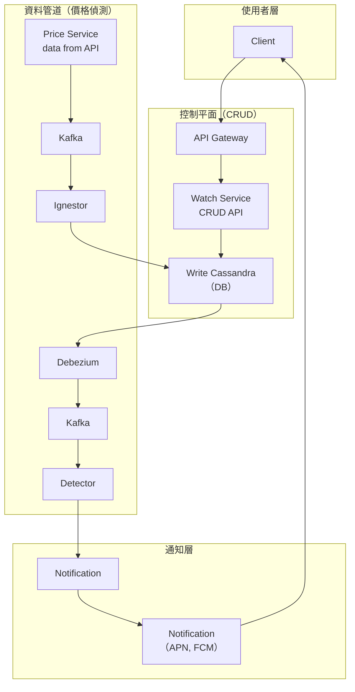
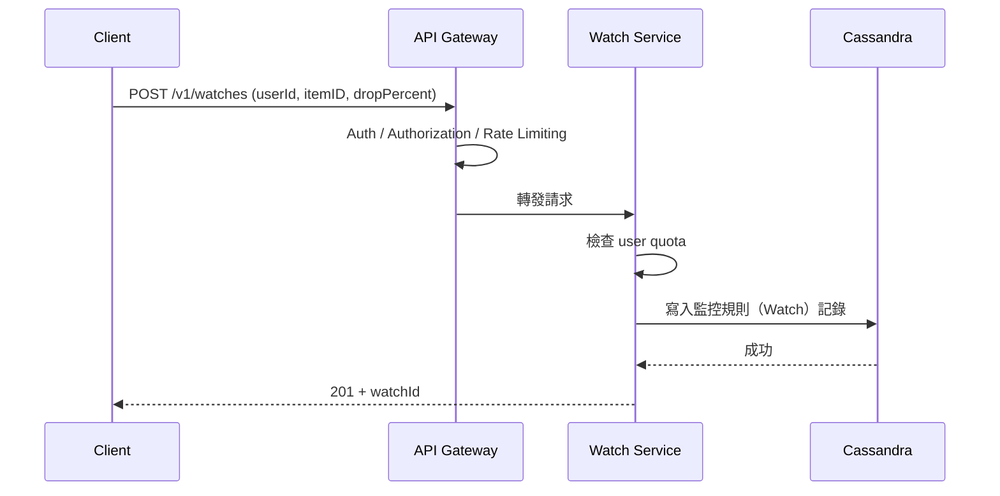
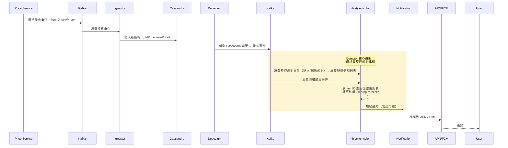
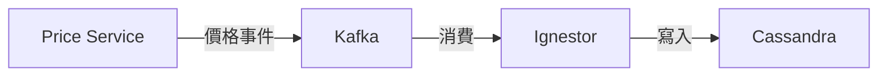
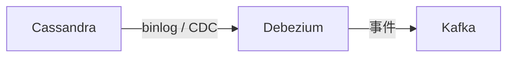
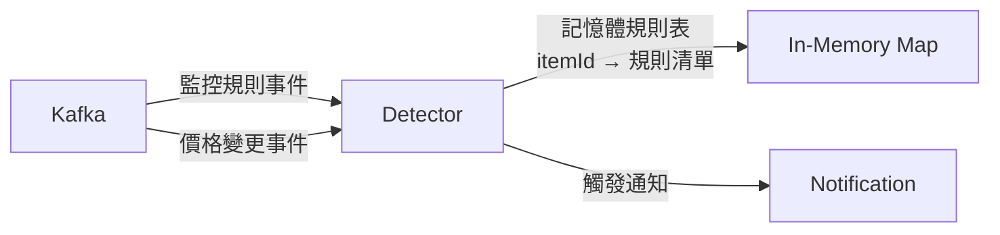

# 價格監控系統（Price Checking System）設計

> 本篇記錄「價格監控系統」的完整設計：使用者設定**監控規則（Watch）**監看商品，當價格下降 **x%** 時收到通知。
> 以 **.NET / ASP.NET Core** 開發者的角度撰寫，含需求分析、API 設計、資料模型、高階架構（HLD）與 .NET 實作細節。

---

# 一、內容總覽

## 1. 系統目標

**User should task to monitor the item if the price is dropped by x%.**

白話：使用者可以建立**監控規則（Watch）**，指定某個商品（item）與降價門檻（x%）。當該商品價格跌幅達到 x% 時，系統要**主動通知**使用者。

## 2. 系統全覽圖



> 本篇所有章節對應到此全覽圖的各個元件。

---

# 二、需求分析

## 1. 功能需求（Functional）

- **User dropped x**：使用者可以設定降價門檻 `x%`（例如「降 10% 就通知我」）。
- **Get notification price**：當價格達到門檻，使用者要收到通知。
- **Prices from sites and APIs**：價格資料來源為**外部網站與 API**（需撈取/訂閱價格變更）。

## 2. 非功能需求（Non-Functional）

| 需求 | 目標 | 說明 |
|------|------|------|
| **Latency** | **< 2 min**（價格變更到發出通知） | 端到端延遲：價格變更 → 通知發出，需在 2 分鐘內 |
| **Scale** | **5M DAU**（500 萬日活躍使用者） | 需支援 500 萬 DAU 的查詢與通知量 |
| **Availability** | **All user** | 所有使用者都要能使用（高可用） |
| **Consistent** | **Consistent for alert** | 通知必須一致（不能漏通知 / 重複通知要控制） |

## 3. 範圍外（Out of Scope）

- **Payment（付款）**：本系統不處理付款。

---

# 三、API 設計

## 1. POST /v1/watches（建立監控規則）

建立一個新的降價監控規則。

| 項目 | 內容 |
|------|------|
| **Req** | `userId`, `itemID`, `dropPercent` |
| **Resp** | `status`, `createdAt`, `watchId` |

```json
// Request
{
  "userId": "user-123",
  "itemID": "item-456",
  "dropPercent": 10
}

// Response
{
  "status": "created",
  "createdAt": "2026-01-01T08:00:00Z",
  "watchId": "watch-789"
}
```

## 2. GET /v1/watches（查詢監控規則）

列出某使用者的所有監控規則，**分頁**用 cursor（遊標分頁）。

| 項目 | 內容 |
|------|------|
| **Req** | `userID`, `page`, `cursor` |
| **Resp** | `watches`, `page`, `nextCursor` |

```json
// Response
{
  "watches": [
    { "watchId": "watch-789", "itemID": "item-456", "dropPercent": 10, "createdAt": "..." }
  ],
  "page": 1,
  "nextCursor": "abc123..."
}
```

### I. 為什麼用 Cursor 分頁？

- **傳統 offset 分頁**（`LIMIT 10 OFFSET 100`）在資料量大時效能差，且新增/刪除時會跳列。
- **Cursor（遊標）分頁**：用「上一頁最後一筆的 ID」當基準，查「比這個 ID 大的 N 筆」——**穩定且可走索引**。

```csharp
// 範例：Cursor 分頁查詢
public async Task<WatchPage> GetWatches(string userId, string? cursor, int limit)
{
    var query = _db.Watches
        .Where(w => w.UserId == userId);

    if (cursor != null)
        query = query.Where(w => string.Compare(w.WatchId, cursor) > 0);

    var items = await query
        .OrderBy(w => w.WatchId)
        .Take(limit + 1)
        .ToListAsync();

    var hasMore = items.Count > limit;
    var page = items.Take(limit).ToList();

    return new WatchPage(page, hasMore ? page.Last().WatchId : null);
}
```

## 3. DELETE /v1/watches（刪除監控規則）

| 項目 | 內容 |
|------|------|
| **Req** | `userID`, `watchID` |
| **Resp** | `Response`, `status` |

```json
// Response
{
  "status": "deleted"
}
```

## 4. webhook events（Webhook 事件）

- 系統可接收/發送事件通知。
- **Req**：`eventID`, `type`, `payload`。

| 欄位 | 說明 |
|------|------|
| `eventID` | 事件唯一 ID（可用來去重，避免重複處理） |
| `type` | 事件類型（例如 `price.changed`、`watch.triggered`） |
| `payload` | 事件內容（JSON） |

> **實務提醒（以讀者要實作為目標）：** webhook 事件通常要**驗簽（HMAC）＋冪等（Idempotency）**——用 `eventID` 去重，防止來源系統重試造成重複通知（呼應 Communication Patterns 篇）。

---

# 四、資料模型（Entities）

## 1. 三個核心 Entity

| Entity | 欄位 | 說明 |
|--------|------|------|
| **User** | `email`, `quotas` | 使用者：email、監控規則配額（quota） |
| **Watch** | `userid`, `itemid`, `droppercent`, `createdAt` | 監控規則：誰、看什麼商品、降多少就通知 |
| **Product** | `watchid`, `oldPrice`, `newPrice` | 商品價格：該監控規則對應的舊價/新價 |

## 2. Entity 關係圖



> **Key 邏輯：** `Watch`（監控規則）是核心——它把「User + Product + 降價門檻」綁在一起。`Product` 記錄「降價前後」的價格，Detector 就是拿 `oldPrice` vs `newPrice` 計算跌幅是否達 `dropPercent`。

## 3. C# DTO 範例

```csharp
public record User(string Id, string Email, int Quotas);

public record Watch(string Id, string UserId, string ItemId, decimal DropPercent, DateTime CreatedAt);

public record Product(string Id, string WatchId, decimal OldPrice, decimal NewPrice);
```

---

# 五、高階架構（HLD）

## 1. 完整架構圖



## 2. 兩條主要資料流

### I. 控制流（Control Flow）——建立監控規則



### II. 資料流（Data Flow）——價格變更偵測與通知



## 3. 為什麼用這個架構？關鍵設計決策

| 元件 | 角色 | 選擇理由 |
|------|------|---------|
| **API Gateway** | 統一入口 | Auth / Authorization / Rate Limiting 集中管理 |
| **Watch Service** | CRUD API | 處理使用者的監控規則 |
| **Cassandra（Write）** | 主資料庫 | 高寫入吞吐、水平擴展，適合 5M DAU 規模 |
| **Debezium** | CDC（Change Data Capture） | 監聽 Cassandra 變更，把「新增監控規則」轉成事件 |
| **Kafka** | 事件匯流排 | 解耦生產者/消費者，緩衝尖峰，可重放 |
| **Detector** | 降價判定 | 消費價格事件，比對監控規則門檻 |
| **Notification** | 通知服務 | 呼叫 APN（iOS）/ FCM（Android） |
| **Ignestor** | 價格擷取與寫入 | 消費 Kafka 的價格事件，把最新價格寫入 Cassandra（圖中拼寫為 Ignestor，意即 Ingestor） |

---

# 六、各元件詳解（.NET 實作角度）

## 1. API Gateway

- 負責：**Auth（驗證）、Authorization（授權）、Rate Limiting（速率限制）**。
- .NET 可用 **YARP（Reverse Proxy）** 或雲端 API Gateway（AWS API Gateway / Azure APIM）。

```csharp
// YARP 範例：把 /v1/* 導到 Watch Service
"ReverseProxy": {
  "Routes": {
    "watch-route": {
      "ClusterId": "watch-service",
      "Match": { "Path": "/v1/watches/{**catch-all}" }
    }
  },
  "Clusters": {
    "watch-service": {
      "Destinations": {
        "watch": { "Address": "http://watch-service:8080/" }
      }
    }
  }
}
```

## 2. Watch Service（CRUD API）

- 實作三支 API：`POST / GET / DELETE /v1/watches`。
- **Quota 檢查**：使用者建立的監控規則數不能超過 `quotas`。

```csharp
[ApiController]
[Route("/v1/watches")]
public class WatchController : ControllerBase
{
    private readonly IWatchRepository _watches;

    [HttpPost]
    public async Task<IActionResult> Create([FromBody] CreateWatchRequest req)
    {
        // 1. 檢查 user quota
        if (!await _watches.CanCreateWatch(req.UserId))
            return StatusCode(403, "Watch quota exceeded");

        // 2. 建立 watch
        var watch = new Watch(
            Id: Guid.NewGuid().ToString(),
            UserId: req.UserId,
            ItemId: req.ItemId,
            DropPercent: req.DropPercent,
            CreatedAt: DateTime.UtcNow);

        await _watches.AddAsync(watch);

        return Created($"/v1/watches/{watch.Id}", new
        {
            status = "created",
            createdAt = watch.CreatedAt,
            watchId = watch.Id
        });
    }
}
```

## 3. Write Cassandra（DB）

- 選 **Cassandra**：高寫入吞吐、**無單點寫入瓶頸**、水平擴展，符合 5M DAU。
- 寫入的是「監控規則（Watch）記錄」與「Product 價格」。

```csharp
// Cassandra 表結構（CQL）
CREATE TABLE watches_by_user (
    user_id      text,
    watch_id     text,
    item_id      text,
    drop_percent decimal,
    created_at   timestamp,
    PRIMARY KEY (user_id, watch_id)   -- 依 user 分區，方便列出某人的監控規則
);
```

## 4. Price Service（data from API）

- 從**外部網站/API**取得價格。
- 取得後**發布價格變更事件**到 Kafka（作為整個價格管線的生產者）。

```csharp
// 用 HttpClient 撈價格，發布事件到 Kafka
public class PriceIngestService
{
    private readonly IProducer<string, string> _producer;

    public async Task IngestPriceAsync(string itemId)
    {
        var price = await FetchPriceFromApiAsync(itemId);

        await _producer.ProduceAsync("price-changes", new Message<string, string>
        {
            Key = itemId,
            Value = JsonSerializer.Serialize(new { itemId, price, at = DateTime.UtcNow })
        });
    }
}
```

## 5. Ignestor（價格擷取寫入器）

- **消費 Kafka 的價格變更事件**，把最新價格**寫入 Cassandra**。
- 它是「**價格資料的消費者兼寫入端**」：Price Service 只負責撈價格與發布事件，由 Ignestor 負責把價格真正落庫。



```csharp
// Ignestor：消費 Kafka 價格事件，寫入 Cassandra
public class PriceIngestor : BackgroundService
{
    private readonly IConsumer<string, string> _consumer;
    private readonly IPriceRepository _prices;

    protected override async Task ExecuteAsync(CancellationToken ct)
    {
        _consumer.Subscribe("price-changes");
        while (!ct.IsCancellationRequested)
        {
            var result = _consumer.Consume(ct);
            var evt = JsonSerializer.Deserialize<PriceChangedEvent>(result.Message.Value);

            // 寫入/更新 Cassandra 的價格記錄（oldPrice 保留前一次價格）
            await _prices.UpsertAsync(evt.ItemId, evt.Price);
        }
    }
}
```

> **為什麼要把「撈價格」與「寫入」拆成兩個元件？** Price Service 專注對外的 API 呼叫（來源可能很多），Ignestor 專注內部落庫——兩者透過 Kafka 解耦，Price Service 掛了不影響已進 Kafka 的價格，Ignestor 也能獨立擴展消費量。

## 6. Debezium（CDC）

- **Change Data Capture**：監聽 Cassandra 的變更（新 watch、價格更新），**不需應用程式主動發布**。
- 把 DB 變更轉成 Kafka 事件——**解決「資料寫了但事件沒發」的雙寫問題**（呼應 Communication Patterns 的 Outbox 概念，Debezium 是自動化版本）。



## 8. Kafka（事件匯流排）

- **解耦**：Price Service、Watch Service、Detector 彼此不互相呼叫。
- **緩衝尖峰**：價格變更瞬間爆量時，Queue 吸收。
- **可重放**：Detector 掛掉可從上次 offset 重新消費。

## 9. Detector（降價判定）

- 消費 Kafka 的**兩類事件**：
  - **監控規則事件**（建立/刪除）→ 在**記憶體中維護規則表**（`itemId → 規則清單`）。
  - **價格變更事件** → 查記憶體規則表，找出達門檻的規則。
- 核心邏輯：`(oldPrice - newPrice) / oldPrice >= dropPercent` → 觸發通知。



```csharp
public class PriceDropDetector
{
    // 記憶體規則表：itemId → 監控此商品的所有規則（消費規則事件維護）
    private readonly ConcurrentDictionary<string, List<WatchRule>> _rulesByItem = new();
    private readonly INotificationService _notifier;

    /// <summary>消費「監控規則事件」（來自 Debezium → Kafka），更新記憶體規則表。</summary>
    public void ApplyRule(WatchRuleEvent evt)
    {
        var rules = _rulesByItem.GetOrAdd(evt.ItemId, _ => new List<WatchRule>());

        if (evt.IsDelete)
            rules.RemoveAll(r => r.WatchId == evt.WatchId);
        else if (rules.All(r => r.WatchId != evt.WatchId))
            rules.Add(new WatchRule(evt.WatchId, evt.UserId, evt.ItemId, evt.DropPercent));
    }

    /// <summary>消費「價格變更事件」，用記憶體規則表比對。</summary>
    public async Task Handle(PriceChangedEvent evt)
    {
        if (!_rulesByItem.TryGetValue(evt.ItemId, out var rules))
            return;   // 沒人監控此商品 → 直接跳過

        var dropPct = (evt.OldPrice - evt.NewPrice) / evt.OldPrice;

        foreach (var watch in rules)
        {
            if (dropPct >= watch.DropPercent)
            {
                // 冪等：用 watchId + price 當鍵，避免重複通知
                await _notifier.NotifyPriceDropAsync(watch.UserId, watch, evt.NewPrice);
            }
        }
    }
}
```

> **為什麼規則放記憶體、不查 Cassandra？** Detector 是**高吞吐、低延遲**的判定器，價格事件可能每分鐘上千筆；若每次價格變更都去 Cassandra 點查規則，會變成**效能瓶頸**。改為從 Kafka 消費規則變更、在記憶體維護 `itemId → 規則` 的索引，Detector 就能以 **O(1)** 查詢對應規則。

### I. 「Consistent for alert」怎麼達成？

- **At-least-once 消費 + 冪等通知**：Kafka 可能重複送同一事件，Detector 重跑可能重複通知。
- **解法**：通知端用 `(watchId, priceChangeVersion)` 當**冪等鍵**去重，確保每個降價只通知一次。
- **規則表重建**：Detector 掛掉重啟時，需**重放** Kafka 的規則事件（或從 `KTable` / 快照重建記憶體規則表），否則規則遺失會漏通知。

## 10. Notification（APN, FCM）

- iOS 用 **APN（Apple Push Notification）**、Android 用 **FCM（Firebase Cloud Messaging）**。
- .NET 可用 **Firebase Admin SDK** 或自訂 HTTP 呼叫。

```csharp
// FCM 通知範例（Firebase Admin SDK）
var message = new Message
{
    Token = deviceToken,                 // 使用者裝置 token
    Notification = new Notification
    {
        Title = "Price Drop!",
        Body = $"Item {itemName} dropped to ${newPrice}"
    }
};
await FirebaseMessaging.DefaultInstance.SendAsync(message);
```

---

# 七、非功能需求的達成策略

## 1. Latency < 2 min（價格變更到通知）

- **端到端**：Price Service 撈取 → Kafka → Ignestor 寫入 Cassandra → Debezium → Kafka → Detector → Notification → APN/FCM。
- 每個環節都是**事件驅動、非同步**，正常情形下**秒級**完成，遠低於 2 分鐘。
- **瓶頸通常在「撈取價格的頻率」**：若 Price Service 每 1 分鐘撈一次，延遲就是 1 分鐘 + 處理時間。要保證 <2min，撈取間隔需 <1~1.5min。

## 2. Scale 5M DAU

| 面向 | 策略 |
|------|------|
| **Watch 資料** | Cassandra 水平擴展（sharding by user_id） |
| **價格事件** | Kafka 多 partition 平行消費 |
| **API** | Watch Service 無狀態 + 水平擴展 + LB |
| **通知** | Notification Service 用佇列消化推播量 |

## 3. Availability all user

- **所有元件都 HA**：API Gateway、Watch Service、Cassandra、Kafka 叢集化。
- **Notification 失敗重試**：推播失敗（裝置離線）要進死信佇列或重試，不能漏掉使用者。

## 4. Consistent for alert

- **冪等通知**（用事件 ID / watchId 去重）。
- **Debezium CDC** 確保「DB 變更 → 事件」不遺漏。
- **At-least-once + 去重** 是務實選擇（與 Database Strategies 篇的 consistency 討論一致）。

---

# 八、總結

- **系統目標**：使用者設定降價門檻，價格跌 x% 就收到通知。
- **兩條主流程**：控制流（Client → API Gateway → Watch Service → Cassandra）＋ 資料流（Price Service → Kafka → Detector → Notification → APN/FCM）。
- **關鍵元件**：Watch Service（CRUD）、Cassandra（寫入）、Debezium（CDC）、Kafka（解耦/緩衝）、Detector（降價判定）、Notification（APN/FCM）。
- **非功能達成**：2 分鐘延遲靠事件驅動；5M DAU 靠 Cassandra + Kafka 水平擴展；高可用靠全元件 HA；通知一致性靠冪等去重。
- **範圍外**：不處理付款。

> **資深 .NET 開發者速記：**
> - Watch Service 用 Minimal API / Controller 都行，重點是 quota 檢查與 cursor 分頁。
> - 「價格變更 → 通知」是典型的 **事件驅動 + CDC** 場景：DB 寫入後靠 Debezium 自動發事件，避免雙寫不一致。
> - Detector 一定要做**冪等通知**，否則 Kafka 重放會造成使用者收到重複提醒。
> - 延遲預算的關鍵在**價格撈取頻率**，不是處理管線。
